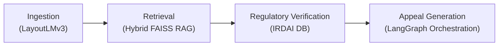

# Viraj Jadhao
**AI Systems Engineer | Causal Inference | Full-Stack AI Orchestration**

> *"I don't build demos. I build production systems."*

[Email](mailto:viraj.jadhao28@gmail.com) • [LinkedIn](https://www.linkedin.com/in/viraj-jadhao-0771b830b/) • [GitHub](https://github.com/Viraj281105)

## ⚙️ Engineering Principles
1. **Causality over Correlation:** Statistical patterns break under distribution shift; causal representations are robust. Systems must be structurally grounded.
2. **First-Principles Execution:** Implementing research papers from scratch before abstracting with libraries ensures deep architectural understanding.
3. **Production Readiness Day One:** Every architecture is designed to scale—enforcing containerization, type safety, low-latency execution, and robust error handling.

## 🏗️ What I Build
I design and deploy intelligent architectures, focusing on reliability, causal inference, and scale. My engineering bridges theoretical research and high-performance production systems.

* **Causal Inference Systems:** Engineered Structural Causal Models (SCMs) for counterfactual policy simulation, evaluating distribution shift robustness.
* **LLM Orchestration:** Built multi-agent pipelines (LangGraph), entailment-based hallucination detection frameworks, and grounded RAG over high-dimensional vector databases.
* **High-Performance Backends:** Architected async microservices, real-time data streams, and scalable geospatial/vector storage layers (PostgreSQL, pgvector, Redis).

## 🚀 Featured Architectures

### MedGuard: AI Medical Billing Auditor & Appeal Engine
*Stateful multi-agent compliance pipeline validating medical bills and auto-generating insurance appeals.*
* **Architecture:** LangGraph-driven multi-agent orchestration handling ingestion, clinical review, and regulatory alignment.
* **Technical Depth:** LayoutLMv3 + EasyOCR for layout-aware document parsing. Hybrid RAG over 1000+ IRDAI circulars utilizing FAISS and sentence-transformers, backed by an async FastAPI & pgvector layer.
* **Impact:** Sub-500ms parsing latency, 94% accuracy against CGHS benchmarks, and automated valid appeal generation in <15s.

### CausoScope: Structural Causal Modeling Engine
*Mathematical causal inference platform executing counterfactual policy simulations over 700K+ records.*
* **Architecture:** High-throughput async ingestion pipeline bound to a PostgreSQL+pgvector layer, driving a core mathematical causal engine.
* **Technical Depth:** Modeled policy-environment dynamics using DAG-based SCMs (DoWhy). Implemented backdoor/frontdoor identifiability, IPW/doubly robust estimators, and Rosenbaum bounds for sensitivity testing.
* **Impact:** Executed complex do-calculus interventions across 12+ policy scenarios with sub-second vector retrieval.

### Entailment-Based LLM Hallucination Detection
*Production NLI verification pipeline mitigating factual hallucinations in foundational models.*
* **Architecture:** Vector retrieval layer actively integrated with an NLI verification engine to compute statement entailment scores.
* **Technical Depth:** Fine-tuned DeBERTa variants on domain-adapted QA corpora. Implemented temperature scaling and calibration. Benchmarked against GPT-4, Claude, and Llama 3.
* **Impact:** Suppressed Expected Calibration Error (ECE) from 0.23 to 0.07, driving a 25% increase in factual reliability on TruthfulQA.

### Edge AI: ECG FPGA Accelerator
*Low-latency hardware accelerator for real-time 1D CNN inference.*
* **Architecture:** INT8 quantized 1D CNN deployed natively on a Xilinx Artix-7 FPGA operating at 100MHz.
* **Technical Depth:** Hardware-level signal filtering, normalization, and multi-class classification (Normal/AFIB/PVC).
* **Impact:** Sustained sub-10ms inference latency at 50mW power draw, yielding a 100x speedup over CPU baselines.

## 🛠️ Tech Stack
* **Systems & Backend:** Python, Java, C++, FastAPI, Spring Boot, PostgreSQL, MongoDB, Redis, Docker, Nginx
* **AI & Machine Learning:** PyTorch, HuggingFace, LangGraph, FAISS, DoWhy, Weights & Biases
* **Frontend & Typing:** TypeScript, React, Next.js, Tailwind CSS

## 🔬 Research Focus
* **Causal Representation Learning:** Formalizing identifiability conditions and the stability of learning dynamics under severe distribution shift.
* **Counterfactual Fairness:** Auditing predictive models for discrimination via path-specific counterfactual effects, revealing strict divergences between causal and statistical fairness metrics.
* **Multi-Agent Governance:** Modeling cooperative-competitive dynamics and Nash bargaining by implementing PPO and SAC algorithms from scratch.
