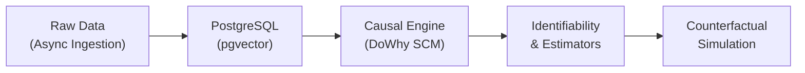
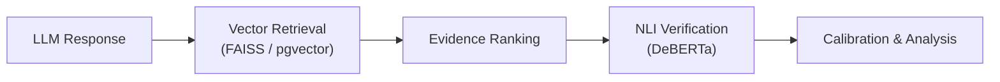

> *"I don't build demos. I build production systems."*

 

---

## 🏗️ Core Capabilities

I architect and deploy intelligent systems, focusing on reliability, causal inference, and scale. My work bridges theoretical research and production engineering.

*   **Causal AI:** Structural Causal Models (SCMs), counterfactual reasoning, and distribution shift robustness.
*   **LLM Orchestration:** Multi-agent architectures (LangGraph), entailment-based hallucination detection, and grounded RAG over large-scale vector databases.
*   **High-Performance Backend:** Asynchronous microservices, real-time data streaming, and scalable database design (PostgreSQL, pgvector, Redis).
*   **Hardware Acceleration:** Edge AI deployment and FPGA-based inference optimization.

---

## ⚙️ Engineering Principles

1.  **Causality over Correlation:** Statistical patterns break under distribution shift; causal representations remain resilient. Systems must be structurally grounded.
2.  **First-Principles Execution:** Implementing research papers from scratch before relying on high-level libraries ensures deep architectural understanding.
3.  **Production Readiness:** Every system is built to ship. This requires containerization, type safety, latency optimization, and robust error handling from day one.

---

## 🛠️ Technical Stack

*   **Languages:** Python, Java, TypeScript, SQL, C++, Verilog
*   **Backend & Infra:** FastAPI, Spring Boot, PostgreSQL, MongoDB, Redis, Docker, Nginx
*   **AI & ML:** PyTorch, HuggingFace, LangGraph, FAISS, DoWhy, Weights & Biases
*   **Frontend:** React, Next.js, Tailwind CSS

---

## 🖥️ Systems & Architecture

### MedGuard: AI Medical Billing Auditor & Insurance Appeal Engine
*Automated compliance review and appeal generation pipeline.*

*   **Architecture:** Stateful multi-agent workflow (LangGraph) orchestrating specialized nodes for ingestion, clinical review, and regulatory compliance.
*   **System Details:** LayoutLMv3 + EasyOCR for document parsing. Hybrid retrieval over 1000+ IRDAI circulars using FAISS and sentence-transformers. Async FastAPI backend with pgvector.
*   **Impact:** Sub-500ms document parsing, 94% accuracy against CGHS benchmarks, and automated valid appeals in <15 seconds.

### CausoScope: Structural Causal Modeling for Policy Evaluation
*Causal inference engine for counterfactual policy simulation over 700K+ records.*

*   **Architecture:** Async data ingestion pipeline feeding into a PostgreSQL + pgvector storage layer, driving a mathematical causal engine.
*   **System Details:** DAG-based SCMs (DoWhy) for policy-environment-economy linkages. Implemented backdoor/frontdoor identifiability, IPW/doubly robust estimators, and Rosenbaum bounds for sensitivity analysis.
*   **Impact:** Executed do-calculus interventions across 12+ policy scenarios with sub-second retrieval latency.

### Entailment-Based LLM Hallucination Detection
*Production pipeline reducing factual hallucinations via Natural Language Inference (NLI).*

*   **Architecture:** Vector retrieval layer integrated with an NLI verification engine to score statement entailment.
*   **System Details:** Fine-tuned DeBERTa-based models on domain-adapted QA corpora. Integrated temperature scaling and calibration for reliability. Benchmarked against GPT-4, Claude, and Llama variants.
*   **Impact:** Reduced Expected Calibration Error (ECE) from 0.23 to 0.07, yielding a 25% increase in factual reliability on the TruthfulQA benchmark.

### FinGuard AI: Personal Finance Risk & Simulation Engine
*Multi-dimensional financial risk assessment and forecasting platform.*

*   **Architecture:** Vector search-backed transaction categorization feeding into a Monte Carlo simulation engine.
*   **System Details:** Sentence-Transformers and FAISS for 91% accurate transaction categorization. Built on Spring Boot, FastAPI, and React.
*   **Impact:** Supported 5 major Indian banks, executing 10,000 Monte Carlo scenarios per run for 6-12 month cash flow forecasting.

### FloatChat: Natural Language to SQL over 3.5M Ocean Records
*Geospatial querying interface deployed at 2 research institutions.*

*   **Architecture:** Semantic parsing layer converting natural language into optimized PostGIS queries, surfaced via a React dashboard.
*   **System Details:** Schema-aware LLM generation mapping to a 3.5M+ ARGO float database. TypeScript, FastAPI, and PostgreSQL.
*   **Impact:** 95%+ query accuracy with sub-200ms database execution latency.

### ECG FPGA Accelerator: Edge Medical AI
*Low-latency hardware accelerator for 1D CNN inference.*

*   **Architecture:** INT8 quantized 1D CNN deployed on a Xilinx Artix-7 FPGA (100MHz).
*   **System Details:** Real-time signal filtering, normalization, and classification (Normal/AFIB/PVC) directly on hardware.
*   **Impact:** Sub-10ms inference latency with 50mW power draw. Achieved a 100x speedup compared to CPU baselines.

### AutoStream Agent: Conversational Lead Qualification
*Production conversational agent pipeline.*

*   **Architecture:** Multi-turn state management via LangGraph, integrated with RAG and intent recognition.
*   **System Details:** Fine-tuned BERT for entity extraction, FAISS for knowledge base retrieval, and BANT-based lead scoring logic with human-in-the-loop escalation.

### Team Vulcans: Robocon 2026 Vision Pipeline
*Autonomous computer vision system for robotics competition.*

*   **Architecture:** Real-time object detection and trajectory planning deployed on edge hardware.
*   **System Details:** Fine-tuned YOLOv8 with INT8 quantization, running at 30 FPS on a Jetson Nano.

---

## 🔬 Research & Publications

*   **Causal Representation Learning:** Formalizing identifiability conditions and stability of learning dynamics under distribution shift.
*   **Counterfactual Fairness:** Auditing predictive models for discrimination via path-specific counterfactual effects. Evaluated on Adult Income and COMPAS datasets, revealing divergence between causal and statistical fairness metrics.
*   **Multi-Agent Governance:** Implemented PPO and SAC algorithms from scratch to model cooperative-competitive dynamics, Nash bargaining, and meritocratic voting in simulated financial markets.

---

## 💼 Experience

### Prodigy InfoTech — Generative AI Intern
*Remote | Jan 2026 – Feb 2026*
*   Engineered domain-coherent text generation by fine-tuning GPT-2 with custom tokenizers and gradient accumulation.
*   Built generative models from first principles, including n-gram Markov Chains with perplexity analysis, Pix2Pix cGANs, and VGG-19 based Neural Style Transfer.
*   Deployed production-ready text-to-image synthesis pipelines using Stable Diffusion and prompt engineering.

---

## 📈 Connect

I am actively seeking **Systems Engineering, MLE, and Research** roles. If your team is building resilient, large-scale AI systems, let's talk.

