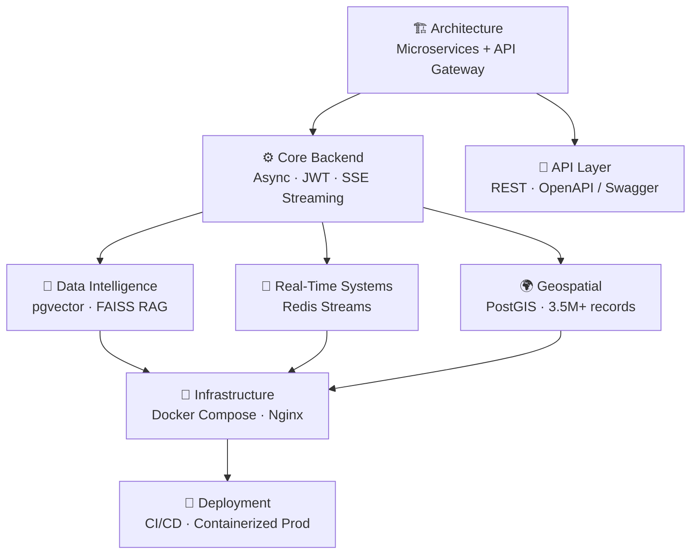
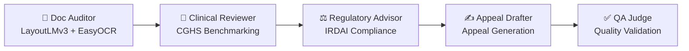
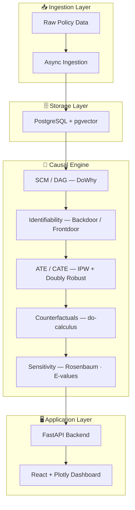
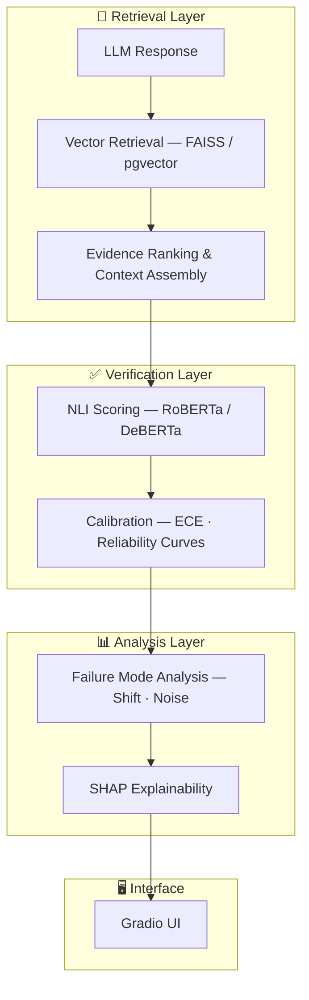
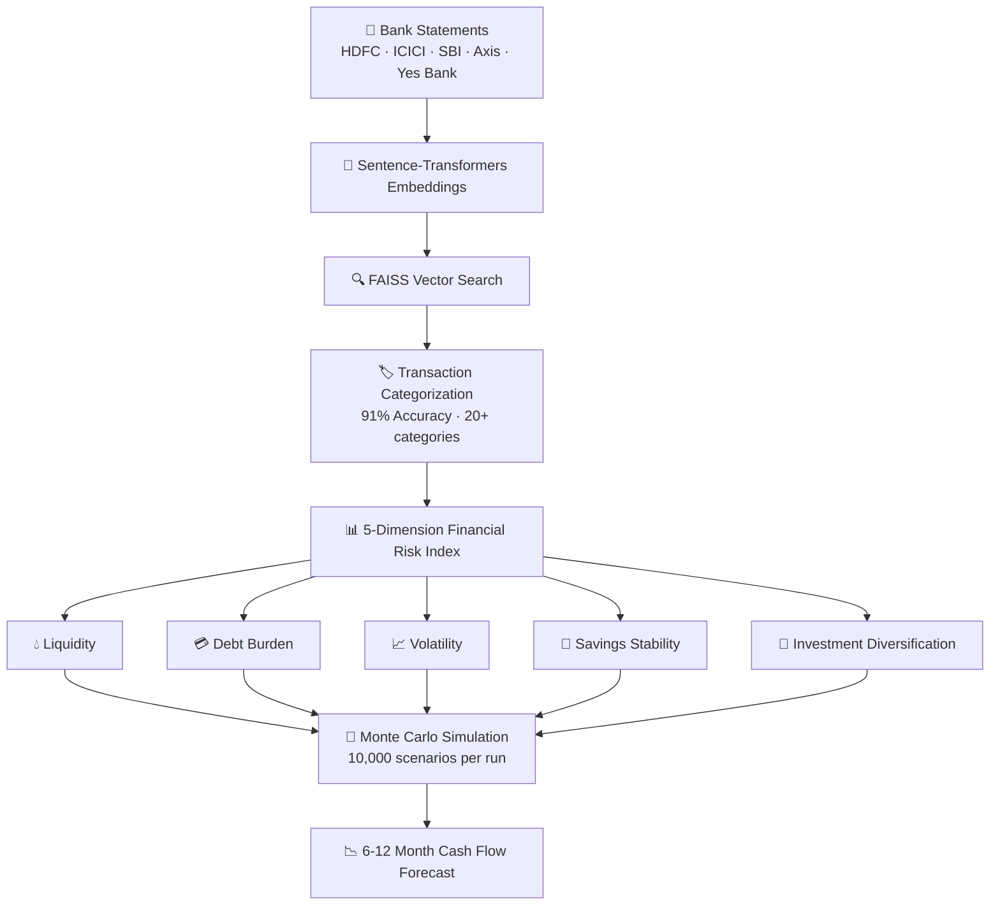
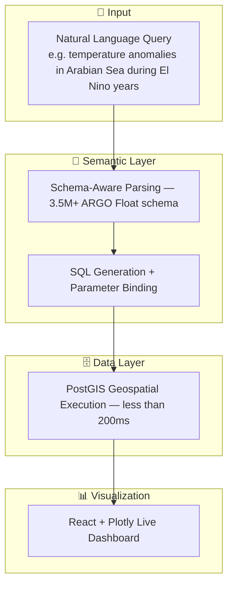
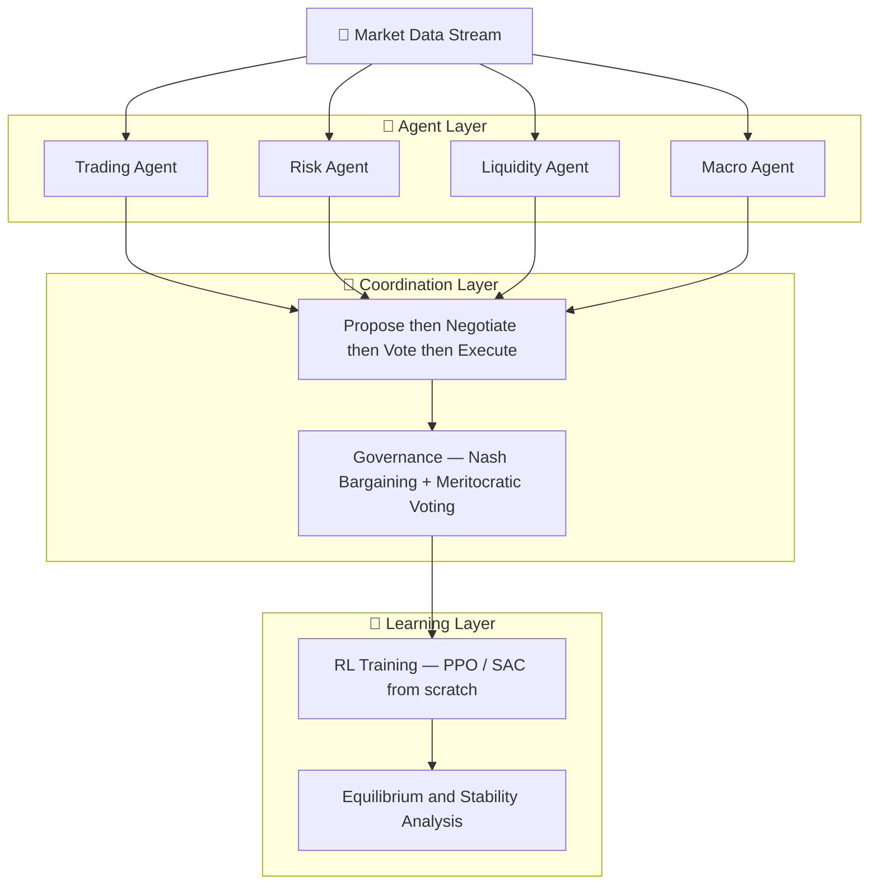
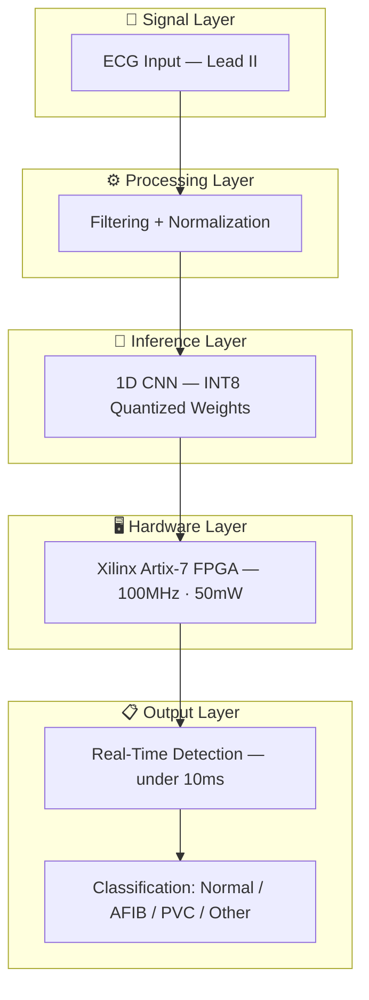
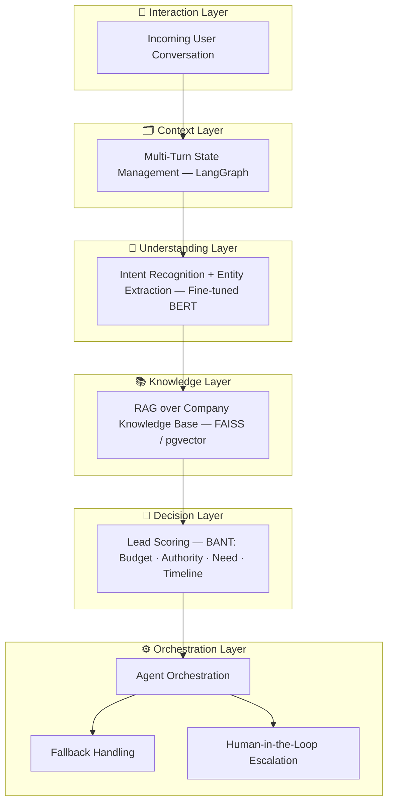
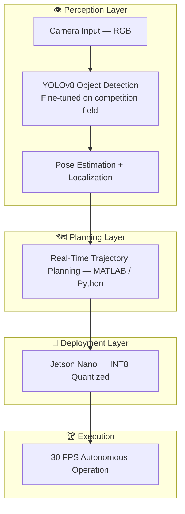

# <!-- HERO BANNER -->

<div align="center">


</div>

<div align="center">


</div>

<br/>

<div align="center">

[](https://github.com/Viraj281105)
[](https://github.com/Viraj281105?tab=followers)
[](https://github.com/Viraj281105)
[](https://github.com/Viraj281105)
[](mailto:viraj.jadhao28@gmail.com)

</div>

---

<div align="center">

## 🌟 `whoami`

</div>

```python
class VirajJadhao:
    def __init__(self):
        self.name          = "Viraj Jadhao"
        self.role          = "AI Systems Engineer & Full-Stack Builder"
        self.university    = "Savitribai Phule Pune University (SPPU)"
        self.cgpa          = 9.136 / 10  # Top 5% of cohort
        self.location      = "Pune, Maharashtra, India 🇮🇳"
        self.email         = "viraj.jadhao28@gmail.com"

        self.research      = [
            "Causal Representation Learning",
            "LLM Hallucination & Reliability",
            "Counterfactual Reasoning",
            "Multi-Agent Reinforcement Learning",
            "Causal Fairness Auditing",
        ]
        self.builds        = [
            "Production RAG Pipelines",
            "Multi-Agent Orchestration (LangGraph)",
            "Full-Stack AI Applications",
            "Real-Time Inference Systems",
            "FPGA-Accelerated Edge AI",
        ]
        self.fun_fact      = "I implement research papers from scratch before using libraries."
        self.current_focus = "Building AI systems that are causally grounded, not just statistically correlated."

    def contact(self):
        return "Always open to research collaborations & challenging engineering roles 🤝"
```

---

## 🧭 Quick Navigation

<div align="center">

[](#-technical-expertise)
[](#-experience--internships)
[](#-flagship-projects)
[](#-research--publications)
[](#-leadership--impact)
[](#-lets-connect)

</div>

---

## 🚀 Technical Expertise

### 💻 Languages & Proficiency

<div align="center">

| Language | Primary Use Case | Level |
|:--------:|:----------------:|:-----:|
|  | AI/ML · Backend APIs · Data Pipelines | `█████████░` 95% |
|  | Spring Boot · Enterprise Systems | `████████░░` 80% |
|  | Type-Safe Frontend · React / Next.js | `████████░░` 80% |
|  | Full-Stack Development | `████████░░` 80% |
|  | Database Design · Query Optimization | `████████░░` 80% |
|  | Systems Programming · Optimization | `██████░░░░` 65% |
|  | RTL Design · FPGA Development | `█████░░░░░` 55% |

</div>

---

### ⚙️ Backend & Infrastructure

<div align="center">


</div>

<details>
<summary><b>🔧 Click to expand backend capabilities</b></summary>

<br/>



</details>

---

### 🎨 Frontend

<div align="center">


</div>

---

### 🤖 AI / ML & Research Stack

<div align="center">


</div>

<div align="center">

| Domain | Technologies & Methods |
|:------:|:----------------------|
| **LLM Systems** | RAG pipelines · multi-agent orchestration (LangGraph) · sentence-transformers · fine-tuning (LoRA, QLoRA, adapter) |
| **Causal Inference** | DoWhy · CausalNex · DAG identifiability · do-calculus · ATE/CATE · Rosenbaum bounds · E-values |
| **Generative AI** | Stable Diffusion · Pix2Pix (cGAN) · Neural Style Transfer (VGG-19) · GPT-2 fine-tuning · N-gram Markov chains |
| **Reinforcement Learning** | PPO · SAC · REINFORCE · policy gradients · convergence analysis · entropy regularization |
| **ML Ops** | Model serving · batching · RAGAS · BLEU · BERTScore · W&B experiment tracking |
| **Computer Vision** | LayoutLMv3 · EasyOCR · YOLOv8 · 1D CNNs · FPGA acceleration · Jetson Nano deployment |

</div>

---

### 🧮 Mathematical Foundations

<details>
<summary><b>📐 Click to expand mathematical depth</b></summary>

<br/>

| Area | Topics |
|:----:|:-------|
| **Linear Algebra** | Eigenvalues · SVD · matrix decompositions · vector spaces · spectral theory |
| **Probability & Statistics** | Bayesian inference · hypothesis testing · CIs · sampling theory · calibration |
| **Causal Theory** | SCMs · do-calculus · backdoor/frontdoor criteria · counterfactuals · identifiability |
| **Optimization** | SGD · Adam · convergence analysis · loss landscapes · second-order methods |
| **Information Theory** | Entropy · KL divergence · mutual information · PAC learning bounds |
| **Game Theory** | Nash equilibria · mechanism design · cooperative multi-agent dynamics |

</details>

---

## 💼 Experience & Internships

### 🏢 Prodigy InfoTech — Generative AI Intern
**`Remote` · `Jan 2026 – Feb 2026`**

<details>
<summary><b>📋 View detailed work breakdown</b></summary>

<br/>

| # | Task | Technology | Outcome |
|:-:|:----:|:----------:|:-------:|
| 1 | **GPT-2 Fine-tuning** | HuggingFace Transformers · custom tokenizer · gradient accumulation | Domain-coherent text generation from scratch |
| 2 | **N-gram Markov Chains** | Bigram → trigram → weighted n-gram · smoothing · perplexity analysis | Generative modeling from first principles |
| 3 | **Pix2Pix cGAN** | U-Net generator · PatchGAN discriminator · CMP Facade Dataset | Working image-to-image translation pipeline |
| 4 | **Neural Style Transfer** | VGG-19 feature optimization · Gram matrices · content/style loss | Production-ready style transfer |
| 5 | **Stable Diffusion** | Text-to-image synthesis · prompt engineering · CFG scaling · negative prompts | Production image generation pipeline |

</details>

---

## 🏆 Flagship Projects

<div align="center">

> *"Every project here went from idea → architecture → research → production. No demos."*

</div>

---

### 🩺 MedGuard — AI Medical Billing Auditor & Insurance Appeal Engine
> **`Hackathon (Nexus 2.0)` · `Team of 2` · `🥉 Top 3 Placement`**



| Component | Technology | Technical Deep Dive |
|:---------:|:----------:|:-------------------:|
| **Document Parsing** | LayoutLMv3 + EasyOCR | Multi-modal transformer for structured document understanding |
| **RAG System** | FAISS + sentence-transformers | Zero-hallucination retrieval over 1000+ IRDAI circulars |
| **Orchestration** | LangGraph | Stateful multi-agent workflow with conditional edges + HITL |
| **Frontend** | Next.js 15 + Tailwind + SSE | Real-time streaming of agent outputs |
| **Backend** | FastAPI + PostgreSQL + pgvector | Async processing + vector similarity retrieval |
| **Deployment** | Docker Compose (3 services) + Nginx | Production containerization with reverse proxy + SSL |

<div align="center">

**🎯 Key Metrics**


[](https://github.com/Viraj281105/MedGuard)

</div>

---

### 🌀 CausoScope — Structural Causal Modeling for Policy Evaluation
> **`Hackathon` · `700K+ Records` · `Climate Policy Intelligence`**



<details>
<summary><b>🔬 Research contribution breakdown</b></summary>

<br/>

| Component | Implementation | Research Contribution |
|:---------:|:--------------:|:--------------------:|
| **Causal Model** | SEMs for policy → environment → economy | Formalized causal assumptions as DAGs |
| **Identifiability** | Backdoor/frontdoor criteria via graphical tests | Proved identifiability conditions |
| **Estimators** | IPW + doubly robust methods | Bias/variance comparison study |
| **Counterfactuals** | do(X=x) across 12+ policy scenarios | Implemented Pearl's do-calculus |
| **Robustness** | Sensitivity analysis for latent confounders | Quantified Rosenbaum bounds |
| **Scale** | 700K+ records, sub-second pgvector retrieval | Production-scale causal inference |

</details>

<div align="center">

[](https://github.com/Viraj281105/ClimateX)

</div>

---

### 🔍 Entailment-Based LLM Hallucination Detection
> **`Production Pipeline` · `+25% Factual Reliability` · `Benchmarked on TruthfulQA`**



<div align="center">


[](https://github.com/Viraj281105/AI-Hallucination-Detection-Application)

</div>

---

### 🏦 FinGuard AI — Personal Finance Risk & Simulation Engine
> **`In Development` · `Beta: 50+ Users` · `Spring Boot · FastAPI · React`**



<div align="center">


[](https://github.com/Viraj281105/sas-fin-intelligence-platform)

</div>

---

### 🌊 FloatChat — Natural Language to SQL over 3.5M Ocean Records
> **`Production` · `TypeScript · FastAPI · React · PostGIS` · `2 Research Institutions`**



<div align="center">


[](https://github.com/Viraj281105/FloatChat)

</div>

---

### ⚖️ Real-Time Multi-Agent Governance (RL from First Principles)
> **`Research` · `Financial Markets` · `PPO/SAC Implemented from Scratch`**



<details>
<summary><b>⚙️ RL implementation details</b></summary>

<br/>

| RL Component | Implementation Details |
|:------------:|:---------------------:|
| **Algorithm** | PPO clipped surrogate objective · SAC entropy regularization |
| **From Scratch** | Policy gradients · value function approximation · GAE advantage estimation |
| **Multi-Agent** | Cooperative-competitive dynamics · negotiation protocols · credit assignment |
| **Analysis** | Convergence diagnostics · variance under learning rate schedules |
| **Environment** | Custom financial market simulator with transaction costs and slippage |

</details>

<div align="center">

[](https://github.com/Viraj281105/Real-Time-Multi-Agent-Governance)

</div>

---

### 💓 ECG FPGA Accelerator — Edge Medical AI
> **`FPGA Hackathon 2026` · `Xilinx Artix-7` · `100x Faster than CPU`**



<div align="center">


[](https://github.com/Viraj281105/ecg_fpga_accelerator)

</div>

---

### 🤖 AutoStream Agent — Conversational Lead Qualification
> **`Production Agents` · `LangGraph · RAG · FastAPI`**



<div align="center">

[](https://github.com/Viraj281105/autostream-agent)

</div>

---

### 🤼 Team Vulcans — Robocon 2026 Vision Pipeline
> **`ABU Robocon Competition` · `AI & CV Lead` · `30 FPS on Jetson Nano`**



<div align="center">


[](https://github.com/Viraj281105/Team-Vulcans-Robocon-2026)

</div>

---

## 📖 Research & Publications

<div align="center">

> **Primary Research Interest:** Causal representation learning, counterfactual reasoning, and robustness under distribution shift — with focus on identifiability, stability of learning dynamics, and reliable inference in LLM-based decision systems.

</div>

---

### 📄 Research Projects

<details open>
<summary><b>1. 🌀 CausoScope — Structural Causal Modeling for Policy Evaluation</b></summary>

<br/>

*Formal causal inference framework for climate policy analysis*

- Formulated **structural causal models (SCMs)** linking policy interventions (carbon pricing, subsidy allocation) with environmental and economic outcomes, explicitly encoding assumptions via DAGs
- Conducted **identifiability analysis** under backdoor and frontdoor criteria; implemented ATE and CATE estimators using IPW and doubly robust methods
- Performed **counterfactual simulations** across 12+ policy intervention scenarios using do-calculus
- Detected instability under latent confounding; introduced **sensitivity analysis** (Rosenbaum bounds, E-values) to quantify robustness bounds
- Characterized **estimator variance** across bootstrapped samples (n=1000)

</details>

<details>
<summary><b>2. 🔍 Entailment-Based Hallucination Detection in LLMs</b></summary>

<br/>

*NLI framework for factual reliability*

- Formulated hallucination detection as `P(entailment | evidence, claim)` — a conditional NLI problem
- Fine-tuned **DeBERTa-based NLI models** on domain-adapted QA corpora (10K+ examples)
- Achieved **ECE reduction from 0.23 → 0.07** through temperature scaling and recalibration
- Identified 3 distinct failure classes: overconfident contradiction, low-evidence hallucination, semantic drift
- Benchmarked across **5+ LLM variants** (GPT-4, Claude, Llama 2/3, Mistral)

</details>

<details>
<summary><b>3. 🩺 Multi-Agent RAG for Medical Decision Support (MedGuard)</b></summary>

<br/>

*Agentic architecture for medical compliance*

- Architected a **multi-agent decision pipeline** with specialized agents for ingestion, semantic chunking, regulatory reasoning, and audit report generation
- Integrated **hybrid sparse-dense retrieval** over regulatory corpora (CPT coding guidelines, CMS billing rules)
- Employed **re-ranking** to enforce evidence-grounded outputs and reduce factual hallucination
- Analyzed trade-offs between latency, grounding fidelity, and response consistency
- Systematically revealed **failure modes of CoT reasoning** under ambiguous regulatory constraints

</details>

<details>
<summary><b>4. ⚖️ Causal Fairness Auditing in Predictive Models</b></summary>

<br/>

*Counterfactual fairness framework*

- Designed framework to audit ML models for direct and indirect discrimination using **path-specific counterfactual effects**
- Distinguishes legitimate from illegitimate causal pathways to sensitive attributes (gender, race)
- Implemented **counterfactual fairness metrics** and compared against statistical parity and equalized odds
- Evaluated on **Adult Income** and **COMPAS** datasets
- Revealed divergence between causal and statistical fairness notions (up to 0.15 difference in metrics)

</details>

---

### 🔬 Technical Research Foundations

<div align="center">

| Area | Topics |
|:----:|:-------|
| **Math & Theory** | SCMs · identifiability · do-calculus · optimization theory · probabilistic calibration · estimator variance · hypothesis testing |
| **Machine Learning** | Transformer architectures · representation learning · LoRA/QLoRA fine-tuning · policy gradients · domain adaptation |
| **AI Systems & NLP** | RAG · dense/sparse retrieval (FAISS, pgvector, BM25) · NLI-based grounding · RAGAS/BLEU/BERTScore |
| **Infrastructure** | FastAPI · PostgreSQL · MongoDB · Docker · Linux · Git · W&B · LangChain · LlamaIndex |

</div>

---

## 📜 Certifications

<div align="center">


</div>

---

## 🧭 Leadership & Impact

<div align="center">

| Role | Organization | Key Achievements |
|:----:|:------------:|:----------------:|
| 🎯 **Hackathon Director** | College-Wide | Sole organizer & SPOC · **160 teams · 500+ participants** |
| 🏛️ **Vice Chair** | ACM Student Chapter (SPPU) | **6+ technical workshops** on ML/LLMs · **1,000+ students** · 10+ external hackathons |
| 💰 **Sponsorship Lead** | MPulse Technical Fest | Closed **30+ sponsors** · raised **₹1 Lakh+** end-to-end |
| 🤖 **AI & CV Lead** | Team Vulcans Robotics | Built CV pipeline for ABU Robocon 2026 · mentored **5+ junior contributors** |
| 📝 **Technical Blogger** | ACM Chapter | Research documentation on causal inference & LLM evaluation |
| 🏆 **Team Lead** | SIH · SKNCOE · PCCOE IGC | Multi-disciplinary AI prototypes in **<36h** · multiple top finishes |

</div>

---

## 🎓 Education

### 🏛️ Savitribai Phule Pune University (SPPU)
**Bachelor of Engineering in Computer Engineering** — `2023 – May 2027 (Expected)`

<div align="center">

| Metric | Value |
|:------:|:-----:|
| 🏅 **CGPA** | `9.136 / 10` — **Top 5% of cohort** |
| 📍 **Location** | Pune, Maharashtra, India |
| 🔑 **Focus** | AI/ML · Causal Inference · Full-Stack Systems |

</div>

<details>
<summary><b>📚 Relevant Coursework</b></summary>

<br/>

`Discrete Mathematics` · `Data Structures & Algorithms` · `Machine Learning` · `Database Management Systems` · `Computer Networks` · `Theory of Computation` · `Software Engineering` · `Operating Systems` · `Artificial Intelligence` · `Linear Algebra` · `Probability & Statistics`

</details>

---

## 📊 GitHub Activity

<div align="center">


</div>

<div align="center">


</div>

<div align="center">


</div>

---

## 🌐 Let's Connect

<div align="center">

> **I'm actively seeking research internships and SWE/MLE roles where I can build systems that matter.**
> If your team works at the frontier of causal ML, LLM reliability, multi-agent systems, or intelligent systems at scale — let's talk.

<br/>

[](mailto:viraj.jadhao28@gmail.com)
&nbsp;&nbsp;
[](https://www.linkedin.com/in/viraj-jadhao-0771b830b/)
&nbsp;&nbsp;
[](https://github.com/Viraj281105)
&nbsp;&nbsp;
[](https://wa.me/919356805427)

</div>

---

<div align="center">

### 💡 Philosophy

<br/>

*"Correlation is not causation. I build systems that know the difference."*

*"I implement research papers from scratch before importing a library — that's how you actually learn."*

*"Every system I build is meant to ship, not demo."*

<br/>


</div>
