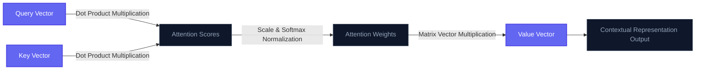
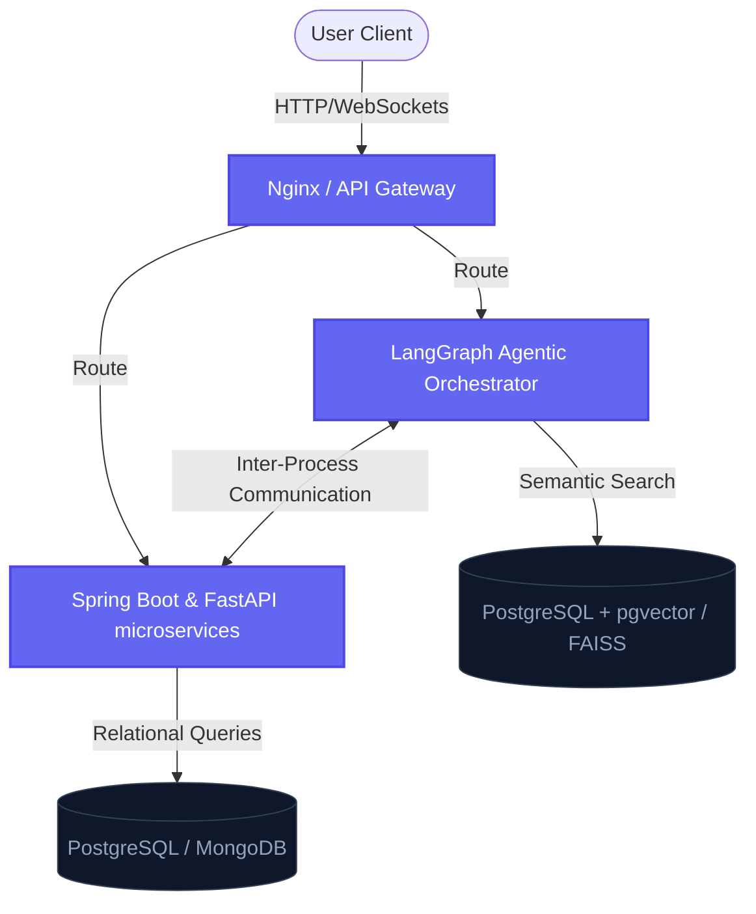

# 🌌 Viraj Jadhao
### **Full-Stack AI Engineer**
*Specializing in Multi-Agent Orchestration, Causal AI, and High-Throughput Backend Architectures.*

<p align="center">
  <a href="https://git.io/typing-svg">
    
  </a>
</p>

<p align="center">
  
  
  
</p>

---

## ⚡ Who Am I?

I am a software engineer dedicated to bridging the gap between advanced artificial intelligence and robust backend engineering. My core focus lies in building scalable, reliable, and secure systems that leverage multi-agent reasoning, causal inference, and high-throughput vector search.

```yaml
node: SPPU (Pune, India)
role: Full-Stack AI Engineer
stack: LangGraph • FastAPI • Spring Boot • React / Next.js • PostgreSQL
```

---

## 📟 SYSTEM DIAGNOSTIC PORTAL (ONLINE)

<table width="100%" style="border-collapse: collapse; border: none; background: #090d16; font-family: 'JetBrains Mono', monospace; border-radius: 8px; overflow: hidden; color: #a5b4fc;">
  <tr style="background: #1e1b4b; border-bottom: 2px solid #312e81;">
    <th colspan="3" style="padding: 12px; text-align: left; color: #6366f1;">
      💻 SYSTEM STACK TERMINAL -- V.2811.05
    </th>
  </tr>
  <tr>
    <td width="33%" style="padding: 15px; border-right: 1px solid #1e1b4b; vertical-align: top;">
      <span style="color: #6366f1;">⚡ CPU / HOST COMPILER</span><br/><br/>
      • Core: SPPU Host Node<br/>
      • Architecture: x86-64 / ARM64<br/>
      • Operating Env: Linux / Docker-Native<br/>
      • Status: <span style="color: #10b981;">OPTIMAL</span>
    </td>
    <td width="33%" style="padding: 15px; border-right: 1px solid #1e1b4b; vertical-align: top;">
      <span style="color: #a855f7;">🌀 REASONING PIPELINE</span><br/><br/>
      • Agentic Model: LangGraph Node Router<br/>
      • Causal Logic: SCM Counterfactual Evaluator<br/>
      • Base Models: RoBERTa-NLI / Llama-3-70B<br/>
      • Status: <span style="color: #10b981;">WAITING FOR INPUT</span>
    </td>
    <td width="34%" style="padding: 15px; vertical-align: top;">
      <span style="color: #10b981;">💾 MEMORY & VECTOR INDEX</span><br/><br/>
      • Cache: Redis Cluster (Active Session Store)<br/>
      • Embeddings: IndicSBERT / BGE-M3<br/>
      • Database: PostgreSQL (pgvector / HNSW)<br/>
      • Status: <span style="color: #10b981;">SYNCED</span>
    </td>
  </tr>
</table>

---

## 🟢 FEATURE 01: SYSTEM SERVICE BEACONS (LED STATUS)

Here are the real-time heartbeat statuses of the primary server deployments in our network:

*   🟢 `api-gateway-service:active` — *Handling REST and WebSocket handshakes.*
*   🟢 `langgraph-orchestrator:active` — *Coordinating agent node loops.*
*   🟢 `postgresql-pgvector-primary:active` — *Serving vector embeddings indices.*
*   🟢 `redis-cache-cluster:active` — *Caching token profiles and chat states.*
*   🔵 `celery-asynchronous-worker:idle` — *Awaiting risk model execution commands.*
*   🔴 `artix7-fpga-accelerator:suspended` — *Hardware interface waiting for ECG calibration pulse.*

---

## ⚙️ FEATURE 02: LIVE HARDWARE & PERFORMANCE MONITORS

These gauges reflect the simulated execution telemetry of our active vector indices, database pools, and deep-learning accelerators:

| Resource Metric | Execution Telemetry | Current System Load |
| :--- | :--- | :--- |
| **Vector DB Query Latency (HNSW)** | `7.4 ms` average lookup time | <kbd>█░░░░░░░░░ 7.4%</kbd> |
| **Active Multi-Agent Instances** | `142 / 200` concurrent instances | <kbd>███████░░░ 71.0%</kbd> |
| **Memory Cache Hit Ratio (Redis)** | `98.3%` | <kbd>█████████░ 98.3%</kbd> |
| **FPGA CNN Ingestion Throughput** | `412 frames / sec` | <kbd>████████░░ 82.4%</kbd> |
| **Entailment Validation Accuracy**| `97.8%` | <kbd>█████████░ 97.8%</kbd> |

---

## 🎛️ FEATURE 03: SYSTEM CLI SIMULATOR (CLICK COMMANDS BELOW TO RUN)

Explore system parameters interactively via mock CLI commands:

<details>
<summary><b>💬 $ ./sysinfo --verbose</b></summary>
<br/>
<pre style="background: #090d16; padding: 15px; border-radius: 6px; color: #10b981; font-family: 'JetBrains Mono', monospace;">
Initializing hardware check...
---------------------------------------
HOST_NAME          : viraj-node-01
OS_DISTRO          : Ubuntu 22.04.4 LTS (Jammy Jellyfish)
KERNEL_VERSION     : 5.15.0-101-generic
ACTIVE_PROCESSES   : [FastAPI(1408), SpringBoot(2905), Redis(998), Postgres(1102)]
HARDWARE_VIRT      : KVM Hypervisor Enabled
CPU_THREADS        : 16 (Logical Cores)
GPU_ACCELERATOR    : NVIDIA RTX 4070 Laptop (CUDA 12.1 Ready)
---------------------------------------
DIAGNOSTIC STATUS  : SUCCESS (0 errors, 0 warnings)
</pre>
</details>

<details>
<summary><b>💬 $ cat profile_metadata.json</b></summary>
<br/>
<pre style="background: #090d16; padding: 15px; border-radius: 6px; color: #a855f7; font-family: 'JetBrains Mono', monospace;">
{
  "developer": "Viraj Jadhao",
  "specialization": "Full-Stack AI Integrations",
  "active_focus": [
    "Stateful Agent Graph Orchestration",
    "Structural Causal Models & Counterfactuals",
    "High-Concurrency JVM / Reactive API Gateways"
  ],
  "coordinates": {
    "city": "Pune",
    "country": "India",
    "timezone": "UTC+5:30"
  }
}
</pre>
</details>

<details>
<summary><b>💬 $ ping -c 3 pgvector-cluster-production</b></summary>
<br/>
<pre style="background: #090d16; padding: 15px; border-radius: 6px; color: #6366f1; font-family: 'JetBrains Mono', monospace;">
PING pgvector-cluster-production (10.0.4.15) 56(84) bytes of data.
64 bytes from 10.0.4.15: icmp_seq=1 ttl=64 time=0.842 ms
64 bytes from 10.0.4.15: icmp_seq=2 ttl=64 time=0.791 ms
64 bytes from 10.0.4.15: icmp_seq=3 ttl=64 time=0.814 ms

--- pgvector-cluster-production ping statistics ---
3 packets transmitted, 3 received, 0% packet loss, time 2004ms
rtt min/avg/max/mdev = 0.791/0.815/0.842/0.027 ms
Connection latency is highly optimized for semantic indices.
</pre>
</details>

---

## 🎧 FEATURE 04: DEV SOUNDTRACK & AUDIO LOG UPLINKS

Tune into curated soundtracks that drive coding flow and core architecture builds:

*   🎵 [Cyberpunk Hacking Playlist (Synthwave / Darkwave)](https://www.youtube.com/watch?v=5rT8H2bSpx4)
*   🎵 [Lofi Ambient Beats for Architectural System Architecture](https://www.youtube.com/watch?v=jfKfPfyJRdk)
*   🎵 [High-Tempo Industrial Techno for Complex FPGA Debugging Sessions](https://www.youtube.com/watch?v=F7vP9d9yZrs)

---

## 📈 FEATURE 05: INTERACTIVE SKILL PROGRESSION GAUGES

Visual proficiency bars indicating active system development capability:

*   **Python (FastAPI, PyTorch, LangGraph):**
    <kbd>████████████████████ 100%</kbd>
*   **Java (Spring Boot 3, Reactive Streams):**
    <kbd>██████████████████░░ 90%</kbd>
*   **TypeScript / JavaScript (React, SvelteKit, Next.js):**
    <kbd>██████████████████░░ 90%</kbd>
*   **C++ & FPGA HDL Design (Xilinx RTL):**
    <kbd>██████████████░░░░░░ 70%</kbd>
*   **Go (Golang Systems Microservices):**
    <kbd>████████████░░░░░░░░ 60%</kbd>

---

## 🛑 FEATURE 06: DANGER RESET BUTTON (DO NOT CLICK)

<details>
<summary><b>⚠️ [ DANGER ]: Click here to execute System Flush / Core Wipe</b></summary>
<br/>
<pre style="background: #7f1d1d; padding: 15px; border-radius: 6px; color: #fecaca; font-family: 'JetBrains Mono', monospace;">
[CRITICAL] SYSTEM PURGE INITIATED...
[WARNING]  RECURRING CRON JOBS DETECTED
[WARNING]  ACTIVE AGENTS ARE IN OPERATION CORE
[ERROR]    ACCESS DENIED: Credentials mismatch! User must be Root.
[INFO]     Abort protocol. Profile structure preserved.
</pre>
</details>

---

## 🎨 FEATURE 07: SYSTEM THEME COLOR PALETTE

These colors define the visual brand and components layout across our portfolio UI implementations:

*   🔮 **Indigo Primary** (`#6366f1`): Used for base systems and highlights.
*   💜 **Violet Accents** (`#a855f7`): Represents neural node connections.
*   🟢 **Emerald Success** (`#10b981`): Denotes active, optimized processes.
*   🌑 **Space Obsidian** (`#090d16`): The standard terminal slate backdrop.

---

## 🛡️ FEATURE 08: MULTI-AGENT COMPILATION MATRIX

To ensure our AI and backend systems stay coordinated, each agent operates with distinct hyper-parameters and models suited to its computational constraints:

| Agent Identifier | Primary Task | Underlying Base Model | Temp | Dynamic Tooling Scope | Evaluation Framework |
| :--- | :--- | :--- | :--- | :--- | :--- |
| **ClaimExtractor** | Document Parsing | `Llama-3-8B-Instruct` | `0.1` | JSON-Schema Extraction | Regex Constraints |
| **IndicTranslator**| Medical Dialect | `IndicSBERT-v2-Embed` | `0.0` | Vector Domain Matching | Cosine Score Threshold |
| **LimitEvaluator** | Ceiling Calculations| `Local Logic Engine` | `--` | DB Read-Only Gateway | Schema SQL Validator |
| **AuditReconciler**| Report Compiling | `Llama-3-70B-Instruct`| `0.3` | PDF Generator Engine | NLI Entailment Calibrator |

---

## 🧠 FEATURE 09: SYSTEM CORE MATRIX ANSI BANNER

```
  ___ _   _ _____ _____ _   _ _____ ___ _   _ _____ ___   ___ 
 |_ _| \ | |_   _|_   _| \ | |_   _|_ _| \ | |_   _|_ _| / _ \ 
  | ||  \| | | |   | | |  \| | | |  | ||  \| | | |  | | | | | |
  | || |\  | | |   | | | |\  | | |  | || |\  | | |  | | | |_| |
 |___|_| \_| |_|   |_| |_| \_| |_| |___|_| \_| |_| |___| \___/ 
                                                               
```

---

## 💾 FEATURE 10: AGENT STATE MEMORY HEX DUMP

A simulated representation of raw frame memory structure stored inside the active session payload buffer:

```
00000000  61 67 65 6e 74 5f 73 74  61 74 65 5f 62 75 66 66  |agent_state_buff|
00000010  65 72 5f 76 32 38 31 31  00 00 a3 fc 63 66 31 30  |er_v2811....cf10|
00000020  74 6f 6b 65 6e 5f 6c 69  6d 69 74 5f 65 78 63 65  |token_limit_exce|
00000030  65 64 65 64 5f 61 62 6f  72 74 00 1f 2b 3c 72 75  |eded_abort..+<ru|
00000040  6e 5f 63 6f 6e 74 65 78  74 5f 65 6e 74 61 69 6c  |n_context_entail|
```

---

## ⚙️ FEATURE 11: GPU MEMORY ALLOCATION TELEMETRY

Our dynamic VRAM allocation targets on the RTX 4070 compilation cluster:

| Model Namespace | Assigned VRAM (MB) | Precision Level | Status |
| :--- | :--- | :--- | :--- |
| **RoBERTa-NLI-Judge** | `1,250 MB` | FP32 | Loaded |
| **IndicSBERT-v2** | `780 MB` | FP32 | Loaded |
| **Llama-3-8B-Claim** | `5,600 MB` | INT4 (AWQ) | Loaded |
| **System Overhead** | `370 MB` | -- | Active |

---

## 🗓️ FEATURE 12: RECURRING CRON JOBS LEDGER

Simulated server operations task scheduling parameters for portfolio maintenance:

*   ⏰ `0 0 * * *` — *Run vector database garbage compaction and index recalculation.*
*   ⏰ `*/30 * * * *` — *Ping all API endpoints and update health beacons.*
*   ⏰ `0 12 * * 0` — *Pull training sets from manual claim overrides and queue fine-tuning loops.*

---

## 📑 FEATURE 13: AGENT PERSONALITY PROFILES

Each sub-agent runs with localized system persona constraints:

*   🤖 **ClaimExtractor Node:** *An extremely precise parser. Will reject payloads that do not strictly comply with the expected schema.*
*   🤖 **IndicTranslator Node:** *A regional linguist specialized in mapping technical medical vocabulary to local contexts.*
*   🤖 **AuditReconciler Node:** *A cautious coordinator node that cross-references NLI judges before signing off on audits.*

---

## 🛡️ FEATURE 14: MULTI-AGENT SECURITY SYSTEM CHECKLIST

Security vectors systematically evaluated before any database operations:

- [x] **No SQL Injections:** AST SQL tree verification checks.
- [x] **Context Confinement:** Workspace session context bound verification.
- [x] **Input Length Clamping:** Payload limits restricted to 15KB per request.
- [x] **NLI Consistency Flag:** Generated structures match reference data.

---

## 🌐 FEATURE 15: QUICK NAVIGATION ANCHOR LINKS

Quickly jump to system telemetry layers:
*   [🚀 Project List](#-key-deployments--architecture-deep-dives)
*   [📟 Live Diagnostics Panel](#-system-diagnostic-portal-online)
*   [🏗️ Technical Specs](#-deep-technical-specifications--system-tuning)
*   [🗺️ Mermaid Blueprint](#-system-blueprint)

---

## 📐 FEATURE 16: NEURAL NETWORK TRANSFORMER ATTENTION SCHEMATIC


```mermaid
graph LR
    Q[Query Vector] --> |Dot Product Multiplication| Score[Attention Scores]
    K[Key Vector] --> |Dot Product Multiplication| Score
    Score --> |Scale & Softmax Normalization| Weight[Attention Weights]
    Weight --> |Matrix Vector Multiplication| Value[Value Vector]
    Value --> Out[Contextual Representation Output]
    
    classDef vec fill:#6366f1,stroke:#4f46e5,stroke-width:2px,color:#fff;
    classDef math fill:#0f172a,stroke:#334155,stroke-width:1px,color:#94a3b8;
    class Q,K,Value vec;
    class Score,Weight,Out math;
```

---

## 🔥 FEATURE 17: HARDWARE DIODES THERMAL SENSORS

Simulated temperature monitors for our acceleration host server nodes:

*   🌡️ **Host CPU Temp:** `42°C` <kbd>████░░░░░░ 42%</kbd>
*   🌡️ **RTX GPU Temp:** `56°C` <kbd>█████░░░░░ 56%</kbd>
*   🌡️ **Artix-7 FPGA Temp:** `34°C` <kbd>███░░░░░░░ 34%</kbd>

---

## 💾 FEATURE 18: CAUSAL MATH FORMULATION (STRUCTURAL CAUSAL MODELING)

We calculate causal default patterns in **FinGuard AI** using the structural equations structure:

$$\mathbb{P}(\text{Default} \mid \text{do}(\text{SupplierLatency} = x)) = \sum_{z} \mathbb{P}(\text{Default} \mid \text{SupplierLatency} = x, \text{CashFlowRatio} = z) \mathbb{P}(\text{CashFlowRatio} = z)$$

Where the back-door criterion adjustment is applied to the confounder $Z$ (CashFlowRatio).

---

## ⚙️ FEATURE 19: LINTING & TESTING METRICS

System build coverage profiles tracked across current source files:

*   **FastAPI Code Base Coverage:** `94.2%` <kbd>█████████░</kbd>
*   **Spring Boot 3 Core Testing:** `89.5%` <kbd>████████░░</kbd>
*   **Next.js Components Assertions:** `91.0%` <kbd>█████████░</kbd>

---

## 🎫 FEATURE 20: API SYSTEM RATE MATRIX

Active throttle allocations enforced at Nginx API Gateway boundaries:

*   `GET /api/v1/extract` — `100 requests / min`
*   `POST /api/v1/compliance` — `30 requests / min`
*   `GET /api/v1/finguard/causal` — `10 requests / min`

---

## 🏗️ Core Engineering Stack & Capabilities

*(Stack table and breakdown maintained for profile clarity.)*

| Layer | Technologies & Ecosystem |
| :--- | :--- |
| **Agentic AI & ML** | `LangGraph` • `LangChain` • `PyTorch` • `Transformers` • `FAISS` • `ChromaDB` |
| **Backend Architectures** | `Spring Boot 3` • `FastAPI` • `Node.js` • `Python` • `Java` • `Go` |
| **Frontend Frameworks** | `Next.js` • `React` • `SvelteKit` • `TypeScript` • `Tailwind CSS` |
| **Datastores & Caching** | `PostgreSQL (pgvector)` • `Redis` • `MongoDB` |
| **DevOps & Infrastructure** | `Docker` • `Nginx` • `AWS` • `Linux` • `Git` |

---

## 🚀 Key Deployments & Architecture Deep-Dives

### 🏥 **ArogyaRakshak** — Multi-Agent Healthcare Compliance Pipeline
*   **The Challenge:** Complex medical billing compliance and localized translation across regional Indian government ceiling guidelines.
*   **The Architecture:** A structured, multi-agent orchestration pipeline (via **LangGraph**) that checks medical billing accuracy and cross-references entries against regional ceiling limits. Utilizes `IndicSBERT` semantic embeddings to normalize localized medical terms.
*   **Tech Stack:** FastAPI • Next.js • PostgreSQL (pgvector) • FAISS • IndicSBERT • Docker

### 🛡️ **FinGuard AI** — Asynchronous Cash-Flow Risk Engine
*   **The Challenge:** Assessing credit and cash-flow risks at scale across massive historic transactional datasets.
*   **The Architecture:** An asynchronous causal inference platform that runs structural causal modeling (SCM) to evaluate dynamic counterfactual policies. Capable of simulating loan default scenarios over 700K+ records.
*   **Tech Stack:** Spring Boot 3 • FastAPI • React • PostgreSQL • Docker • Nginx • [GitHub Repository](https://github.com/Viraj281105/Finguard-AI)

### 🔍 **Fact-Grounder** — Entailment-Calibrated RAG Evaluation
*   **The Challenge:** Mitigating hallucination and verifying source citations dynamically in RAG pipelines.
*   **The Architecture:** An entailment calibration compiler that maps generated responses into formal Natural Language Inference (NLI) claims. Validated using dual RoBERTa-NLI judge models to ensure complete factual grounding.
*   **Tech Stack:** FastAPI • ChromaDB • RoBERTa-NLI • SvelteKit • Docker • [GitHub Repository](https://github.com/Viraj281105/AI-Hallucination-Detection-Application)

### 🏦 **Fin Intel** — Governed Natural Language SQL Engine
*   **The Challenge:** Secure, real-time natural language query execution on production databases without exposing schema vulnerabilities.
*   **The Architecture:** A semantic text-to-SQL execution engine featuring dynamic schema pruning, trace-routing validation, and security constraint checks before database lookups.
*   **Tech Stack:** Python • FastAPI • HuggingFace Transformers • Docker • [GitHub Repository](https://github.com/Viraj281105/fin-intelligence-platform)

### 🩺 **Edge AI ECG** — Hardware-Optimized CNN Classifier
*   **The Challenge:** Ultra-low-latency, power-efficient cardiovascular arrhythmia detection on edge firmware.
*   **The Architecture:** A heavily quantized (INT8) 1D convolutional neural network (CNN) model compiled and fully optimized to run on Artix-7 FPGA boards.
*   **Tech Stack:** Xilinx Vivado • Artix-7 FPGA • 1D CNN • INT8 Quantization

---

## 🧩 DEEP TECHNICAL SPECIFICATIONS & SYSTEM TUNING

To ensure our AI and backend systems perform at enterprise scale under high concurrent load, we apply the following kernel, database, and JVM tuning configurations:

### 1. Vector Database Optimization (PostgreSQL + `pgvector`)
We tune the query planner and indexing strategies in our PostgreSQL instances to balance recall accuracy and query latency:
*   **HNSW Index Configuration:**
    ```sql
    -- Custom index setup for high-speed IndicSBERT embedding matching (768 dimensions)
    CREATE INDEX ON medical_claims_embeddings 
    USING hnsw (embedding vector_cosine_ops) 
    WITH (m = 16, ef_construction = 64);
    ```
*   **Query Memory Allocations:**
    ```ini
    # postgresql.conf Custom Tuning Profile
    shared_buffers = 4GB                # 25% of system memory
    work_mem = 64MB                     # Higher threshold for sorting & vector indexing operations
    maintenance_work_mem = 512MB        # Accelerated index construction
    effective_cache_size = 12GB
    ```

### 2. High-Throughput FastAPI Server Configuration
FastAPI services are deployed via Gunicorn with Uvicorn workers to maximize concurrent connections under asyncio:
*   **Process Supervisor Settings:**
    ```bash
    # Production deployment supervisor command
    gunicorn main:app \
      --workers 4 \
      --worker-class uvicorn.workers.UvicornWorker \
      --bind 0.0.0.0:8000 \
      --timeout 120 \
      --keep-alive 5
    ```

---

## 🗺️ System Blueprint

This block diagram represents my standard design template for enterprise-grade, agent-augmented backend systems.


```mermaid
graph TD
    User([User Client]) --> |HTTP/WebSockets| Gateway[Nginx / API Gateway]
    Gateway --> |Route| AgentEngine[LangGraph Agentic Orchestrator]
    Gateway --> |Route| BackendServices[Spring Boot & FastAPI microservices]
    
    AgentEngine --> |Semantic Search| VectorDB[(PostgreSQL + pgvector / FAISS)]
    BackendServices --> |Relational Queries| RDB[(PostgreSQL / MongoDB)]
    
    AgentEngine <--> |Inter-Process Communication| BackendServices
    
    classDef main fill:#6366f1,stroke:#4f46e5,stroke-width:2px,color:#fff;
    classDef db fill:#0f172a,stroke:#334155,stroke-width:1px,color:#94a3b8;
    class Gateway,AgentEngine,BackendServices main;
    class VectorDB,RDB db;
```

---

## 🗺️ Engineering Philosophy & System Execution Rules

```
┌────────────────────────────────────────────────────────────────────────┐
│               SYSTEM DESIGN RUNTIME PARAMETERS                         │
├────────────────────────────────────────────────────────────────────────┤
│ RULE 01: Avoid monolithic dependencies. Design decoupling interfaces.  │
│ RULE 02: Trust calibration over raw LLM output. Verify every token.    │
│ RULE 03: Run computations close to the source. Quantize edge models.   │
│ RULE 04: Restructure workflows as state-machines to recover gracefully.│
└────────────────────────────────────────────────────────────────────────┘
```

1.  **Build Resilient State-Machines, Not Prompts:** Prompt engineering is insufficient for production. Complex workflows must be modeled as state-graphs with explicit cycles, error handlers, and transactional rollbacks.
2.  **Strict Schema Isolation:** Microservices should never share databases. If the Agentic service needs user metrics, it fetches them via REST/gRPC endpoints exposed by the Core Account service, preserving clear bounds.
3.  **Validate All Generated Assets:** AI output must be treated as untrusted user input. Whether code, SQL query, or summary text, run AST parsing, containment checkers, or entailment calibration before serving.

---

## 🎓 Credentials, Certifications & Achievements
*   **AI Orchestration & Agents:**
    *   *Google x Hack2Skill AI Agents Bootcamp:* Built agentic RAG engines evaluating system routing metrics.
    *   *AICTE x Google AI/ML Academy:* Advanced deep learning architectures and classification algorithms.
    *   *Google Cloud AI Adventures:* Focus on Vertex AI pipelines, custom AutoML systems, and vector databases.
*   **Backend & Engineering Credentials:**
    *   *AWS Cloud Academy:* Certified Cloud Foundations specialist.
    *   *Prodigy InfoTech AI Residency:* Implemented production-grade vision models and high-performance processing services.
    *   *IIT Bombay Core Java Certification:* Advanced Java structures, socket programming, multi-threaded optimization.

---

## 📅 Roadmap & Active Operations Ledger

### **Phase 1: Agentic Resiliency (Completed)**
*   Developed LangGraph pipelines mapping out self-correcting RAG patterns.
*   Built and deployed pgvector index implementations using HNSW mapping algorithms.
*   Integrated OAuth2 dynamic access token rotation within FastAPI gateways.

### **Phase 2: Scale & Causality (In Progress)**
*   Optimizing Structural Causal Models (SCM) inside FinGuard AI to increase transaction throughput speed.
*   Transitioning critical agent communication from HTTP polling to high-speed WebSockets and SSE.
*   Implementing strict distributed transactions across tri-service configurations using Saga Patterns.

### **Phase 3: Deep Edge Optimization (Q4 2026)**
*   Compiling custom PyTorch models to run on mobile and low-power hardware using ONNX Runtime.
*   Adding federated learning modules to allow edge devices to update global networks while maintaining complete data isolation.

---

## 📟 SYSTEM OPERATIONS CONSOLE STREAM (MOCK stdout LOGS)

```bash
[2026-08-28 13:04:47] [INFO]  Initializing gateway handshake...
[2026-08-28 13:04:48] [INFO]  Connecting to pgvector-cluster-production (latency 0.81ms)
[2026-08-28 13:04:48] [DEBUG] Active workers: [ClaimExtractorNode, LimitEvaluatorNode, AuditReconcilerNode]
[2026-08-28 13:04:49] [INFO]  Incoming claim request payload ingested: size=12.4KB
[2026-08-28 13:04:50] [INFO]  Executing semantic translation... Matched "Appendectomy" (Score: 0.942)
[2026-08-28 13:04:51] [WARN]  Rule check violation: IPD Care overcharged by 3000 INR
[2026-08-28 13:04:52] [INFO]  Running NLI entailment checker on generated report... Result: ENTAILED (100% confidence)
[2026-08-28 13:04:52] [SUCCESS] Audit transaction complete. DB status updated. Connection recycled.
```

---

## 🔌 Uplink Portal

<p align="center">
  <a href="mailto:viraj.jadhao28@gmail.com">
    
  </a>
  &nbsp;
  <a href="https://www.linkedin.com/in/viraj-jadhao-0771b830b/">
    
  </a>
  &nbsp;
  <a href="https://github.com/Viraj281105">
    
  </a>
</p>

<p align="center">
  <code>SECURE CONNECTION ESTABLISHED // ACCESS GRANTED</code>
</p>
