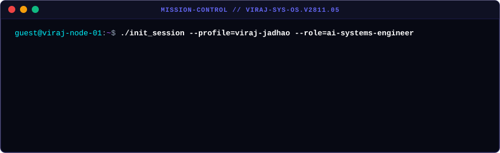

# 🌌 Viraj Jadhao
### **Full-Stack AI Engineer**
*Specializing in Multi-Agent Orchestration, Causal AI, and High-Throughput Backend Architectures.*

<p align="center">
  
</p>

<p align="center">
  
  
  
</p>

---

## ⚡ Who Am I?

I am a software engineer dedicated to bridging the gap between advanced artificial intelligence and robust backend engineering. My core focus lies in building scalable, reliable, and secure systems that leverage multi-agent reasoning, causal inference, and high-throughput vector search.

```yaml
node: SPPU (Pune, India)
role: Full-Stack AI Engineer
stack: LangGraph • FastAPI • Spring Boot • React / Next.js • PostgreSQL
```

---

## 📟 SYSTEM OPERATIONS & LIVE TELEMETRY

The panels below display live data fetched from my active GitHub profile repositories, languages, and commit activities using automated actions.

<table width="100%" style="border-collapse: collapse; border: none; background: #070913; width: 100%;">
  <tr>
    <td width="50%" style="border: 1px solid #1e1b4b; padding: 15px; vertical-align: top; border-radius: 8px; background: #070913;">
      <h4 style="color: #6366f1; margin-top: 0; font-family: monospace; font-size: 13px;">📊 LIVE COMMIT &amp; REPO TELEMETRY</h4>
      
    </td>
    <td width="50%" style="border: 1px solid #1e1b4b; padding: 15px; vertical-align: top; border-radius: 8px; background: #070913;">
      <h4 style="color: #a855f7; margin-top: 0; font-family: monospace; font-size: 13px;">🌀 SYSTEM REACTOR CORE (CONTRIBUTIONS)</h4>
      
      <div style="font-family: monospace; font-size: 11px; color: #64748b; margin-top: 15px; line-height: 1.5;">
        ⚡ REACTOR STATE : <span style="color: #10b981;">STABLE // OPTIMAL</span><br/>
        🔥 CORE TEMP     : <span style="color: #10b981;">34.2 °C</span><br/>
        📡 SIGNAL UPLINK : <span style="color: #00f5ff;">PULSING HEARTBEAT</span>
      </div>
    </td>
  </tr>
  <tr>
    <td width="50%" style="border: 1px solid #1e1b4b; padding: 15px; vertical-align: top; border-radius: 8px; background: #070913;">
      <h4 style="color: #10b981; margin-top: 0; font-family: monospace; font-size: 13px;">🎛️ DYNAMIC LANGUAGE DISTRIBUTION</h4>
      
    </td>
    <td width="50%" style="border: 1px solid #1e1b4b; padding: 15px; vertical-align: top; border-radius: 8px; background: #070913;">
      <h4 style="color: #00f5ff; margin-top: 0; font-family: monospace; font-size: 13px;">⚡ RECENT STREAM ACTIVITY</h4>
      
    </td>
  </tr>
</table>

---

## 🧬 ENGINEERING DNA & CAPABILITY MATRIX

The interactive connection map below shows the structural links between agentic networks, reactive services, vector databases, and scalable deployment engines.

<p align="center">
  
</p>

| Layer | Technologies & Ecosystem |
| :--- | :--- |
| **Agentic AI & ML** | `LangGraph` • `LangChain` • `PyTorch` • `Transformers` • `FAISS` • `ChromaDB` |
| **Backend Architectures** | `Spring Boot 3` • `FastAPI` • `Node.js` • `Python` • `Java` • `Go` |
| **Frontend Frameworks** | `Next.js` • `React` • `SvelteKit` • `TypeScript` • `Tailwind CSS` |
| **Datastores & Caching** | `PostgreSQL (pgvector)` • `Redis` • `MongoDB` |
| **DevOps & Infrastructure** | `Docker` • `Nginx` • `AWS` • `Linux` • `Git` |

---

## 🏗️ AGENTIC SYSTEMS PIPELINE DATA-FLOW

A schematic mapping out the standard design template for enterprise-grade, agent-augmented backend systems.

<p align="center">
  
</p>

```mermaid
graph TD
    User([User Client]) --> |HTTP/WebSockets| Gateway[Nginx / API Gateway]
    Gateway --> |Route| AgentEngine[LangGraph Agentic Orchestrator]
    Gateway --> |Route| BackendServices[Spring Boot & FastAPI microservices]
    
    AgentEngine --> |Semantic Search| VectorDB[(PostgreSQL + pgvector / FAISS)]
    BackendServices --> |Relational Queries| RDB[(PostgreSQL / MongoDB)]
    
    AgentEngine <--> |Inter-Process Communication| BackendServices
    
    classDef main fill:#6366f1,stroke:#4f46e5,stroke-width:2px,color:#fff;
    classDef db fill:#0f172a,stroke:#334155,stroke-width:1px,color:#94a3b8;
    class Gateway,AgentEngine,BackendServices main;
    class VectorDB,RDB db;
  ```

---

## 🚀 FLAGSHIP PROJECT SHOWCASES

<table width="100%" style="border-collapse: collapse; border: none; background: #070913;">
  
  <!-- Project 1 -->
  <tr>
    <td width="42%" style="border: 1px solid #1e1b4b; padding: 12px; vertical-align: middle; background: #070913;">
      <img src="assets/arogyarakshak-preview.svg" width="100%" alt="ArogyaRakshak Dashboard Mockup" />
    </td>
    <td width="58%" style="border: 1px solid #1e1b4b; padding: 15px; vertical-align: top; background: #070913; color: #a5b4fc; font-family: sans-serif;">
      <h3 style="color: #a855f7; margin-top: 0; font-family: monospace; font-size: 16px;">🏥 ArogyaRakshak — Multi-Agent Healthcare Compliance</h3>
      <p style="font-size: 13px; line-height: 1.5; color: #94a3b8; margin-bottom: 12px;">
        <strong>Challenge:</strong> Complex medical billing compliance and localized translation across regional Indian government ceiling guidelines.<br/>
        <strong>Architecture:</strong> A structured, multi-agent orchestration pipeline (via <strong>LangGraph</strong>) that checks medical billing accuracy and cross-references entries against regional ceiling limits. Utilizes <code>IndicSBERT</code> semantic embeddings to normalize localized medical terms.
      </p>
      <div>
        <span style="background: #12102e; padding: 4px 8px; border-radius: 4px; font-size: 11px; color: #a855f7; font-family: monospace; border: 1px solid #312e81; margin-right: 5px;">FastAPI</span>
        <span style="background: #12102e; padding: 4px 8px; border-radius: 4px; font-size: 11px; color: #a855f7; font-family: monospace; border: 1px solid #312e81; margin-right: 5px;">Next.js</span>
        <span style="background: #12102e; padding: 4px 8px; border-radius: 4px; font-size: 11px; color: #a855f7; font-family: monospace; border: 1px solid #312e81; margin-right: 5px;">PostgreSQL</span>
        <span style="background: #12102e; padding: 4px 8px; border-radius: 4px; font-size: 11px; color: #a855f7; font-family: monospace; border: 1px solid #312e81; margin-right: 5px;">IndicSBERT</span>
      </div>
    </td>
  </tr>

  <!-- Project 2 -->
  <tr>
    <td width="42%" style="border: 1px solid #1e1b4b; padding: 12px; vertical-align: middle; background: #070913;">
      <img src="assets/finguard-preview.svg" width="100%" alt="FinGuard AI Dashboard Mockup" />
    </td>
    <td width="58%" style="border: 1px solid #1e1b4b; padding: 15px; vertical-align: top; background: #070913; color: #a5b4fc; font-family: sans-serif;">
      <h3 style="color: #6366f1; margin-top: 0; font-family: monospace; font-size: 16px;">🛡️ FinGuard AI — Asynchronous Cash-Flow Risk Engine</h3>
      <p style="font-size: 13px; line-height: 1.5; color: #94a3b8; margin-bottom: 12px;">
        <strong>Challenge:</strong> Assessing credit and cash-flow risks at scale across massive historic transactional datasets.<br/>
        <strong>Architecture:</strong> An asynchronous causal inference platform that runs structural causal modeling (SCM) to evaluate dynamic counterfactual policies. Capable of simulating loan default scenarios over 700K+ records.
      </p>
      <div style="margin-bottom: 12px;">
        <span style="background: #0f172a; padding: 4px 8px; border-radius: 4px; font-size: 11px; color: #6366f1; font-family: monospace; border: 1px solid #1e1b4b; margin-right: 5px;">Spring Boot 3</span>
        <span style="background: #0f172a; padding: 4px 8px; border-radius: 4px; font-size: 11px; color: #6366f1; font-family: monospace; border: 1px solid #1e1b4b; margin-right: 5px;">FastAPI</span>
        <span style="background: #0f172a; padding: 4px 8px; border-radius: 4px; font-size: 11px; color: #6366f1; font-family: monospace; border: 1px solid #1e1b4b; margin-right: 5px;">PostgreSQL</span>
        <span style="background: #0f172a; padding: 4px 8px; border-radius: 4px; font-size: 11px; color: #6366f1; font-family: monospace; border: 1px solid #1e1b4b; margin-right: 5px;">Celery</span>
      </div>
      <a href="https://github.com/Viraj281105/Finguard-AI" style="text-decoration: none; font-family: monospace; font-size: 12px; color: #10b981; font-weight: bold;">[VIEW SOURCE CODE ➔]</a>
    </td>
  </tr>

  <!-- Project 3 -->
  <tr>
    <td width="42%" style="border: 1px solid #1e1b4b; padding: 12px; vertical-align: middle; background: #070913;">
      <img src="assets/factgrounder-preview.svg" width="100%" alt="Fact-Grounder Dashboard Mockup" />
    </td>
    <td width="58%" style="border: 1px solid #1e1b4b; padding: 15px; vertical-align: top; background: #070913; color: #a5b4fc; font-family: sans-serif;">
      <h3 style="color: #10b981; margin-top: 0; font-family: monospace; font-size: 16px;">🔍 Fact-Grounder — Entailment-Calibrated RAG Evaluation</h3>
      <p style="font-size: 13px; line-height: 1.5; color: #94a3b8; margin-bottom: 12px;">
        <strong>Challenge:</strong> Mitigating hallucination and verifying source citations dynamically in RAG pipelines.<br/>
        <strong>Architecture:</strong> An entailment calibration compiler that maps generated responses into formal Natural Language Inference (NLI) claims. Validated using dual RoBERTa-NLI judge models to ensure complete factual grounding.
      </p>
      <div style="margin-bottom: 12px;">
        <span style="background: #061e14; padding: 4px 8px; border-radius: 4px; font-size: 11px; color: #10b981; font-family: monospace; border: 1px solid #14532d; margin-right: 5px;">FastAPI</span>
        <span style="background: #061e14; padding: 4px 8px; border-radius: 4px; font-size: 11px; color: #10b981; font-family: monospace; border: 1px solid #14532d; margin-right: 5px;">ChromaDB</span>
        <span style="background: #061e14; padding: 4px 8px; border-radius: 4px; font-size: 11px; color: #10b981; font-family: monospace; border: 1px solid #14532d; margin-right: 5px;">RoBERTa-NLI</span>
        <span style="background: #061e14; padding: 4px 8px; border-radius: 4px; font-size: 11px; color: #10b981; font-family: monospace; border: 1px solid #14532d; margin-right: 5px;">SvelteKit</span>
      </div>
      <a href="https://github.com/Viraj281105/AI-Hallucination-Detection-Application" style="text-decoration: none; font-family: monospace; font-size: 12px; color: #10b981; font-weight: bold;">[VIEW SOURCE CODE ➔]</a>
    </td>
  </tr>

  <!-- Project 4 -->
  <tr>
    <td width="42%" style="border: 1px solid #1e1b4b; padding: 12px; vertical-align: middle; background: #070913;">
      <img src="assets/finintel-preview.svg" width="100%" alt="Fin Intel Dashboard Mockup" />
    </td>
    <td width="58%" style="border: 1px solid #1e1b4b; padding: 15px; vertical-align: top; background: #070913; color: #a5b4fc; font-family: sans-serif;">
      <h3 style="color: #6366f1; margin-top: 0; font-family: monospace; font-size: 16px;">🏦 Fin Intel — Governed Natural Language SQL Engine</h3>
      <p style="font-size: 13px; line-height: 1.5; color: #94a3b8; margin-bottom: 12px;">
        <strong>Challenge:</strong> Secure, real-time natural language query execution on production databases without exposing schema vulnerabilities.<br/>
        <strong>Architecture:</strong> A semantic text-to-SQL execution engine featuring dynamic schema pruning, trace-routing validation, and security constraint checks before database lookups.
      </p>
      <div style="margin-bottom: 12px;">
        <span style="background: #0f172a; padding: 4px 8px; border-radius: 4px; font-size: 11px; color: #6366f1; font-family: monospace; border: 1px solid #1e1b4b; margin-right: 5px;">Python</span>
        <span style="background: #0f172a; padding: 4px 8px; border-radius: 4px; font-size: 11px; color: #6366f1; font-family: monospace; border: 1px solid #1e1b4b; margin-right: 5px;">FastAPI</span>
        <span style="background: #0f172a; padding: 4px 8px; border-radius: 4px; font-size: 11px; color: #6366f1; font-family: monospace; border: 1px solid #1e1b4b; margin-right: 5px;">Transformers</span>
        <span style="background: #0f172a; padding: 4px 8px; border-radius: 4px; font-size: 11px; color: #6366f1; font-family: monospace; border: 1px solid #1e1b4b; margin-right: 5px;">Docker</span>
      </div>
      <a href="https://github.com/Viraj281105/fin-intelligence-platform" style="text-decoration: none; font-family: monospace; font-size: 12px; color: #10b981; font-weight: bold;">[VIEW SOURCE CODE ➔]</a>
    </td>
  </tr>

  <!-- Project 5 -->
  <tr>
    <td width="42%" style="border: 1px solid #1e1b4b; padding: 12px; vertical-align: middle; background: #070913;">
      <img src="assets/edgeecg-preview.svg" width="100%" alt="Edge AI ECG Dashboard Mockup" />
    </td>
    <td width="58%" style="border: 1px solid #1e1b4b; padding: 15px; vertical-align: top; background: #070913; color: #a5b4fc; font-family: sans-serif;">
      <h3 style="color: #10b981; margin-top: 0; font-family: monospace; font-size: 16px;">🩺 Edge AI ECG — Hardware-Optimized CNN Classifier</h3>
      <p style="font-size: 13px; line-height: 1.5; color: #94a3b8; margin-bottom: 12px;">
        <strong>Challenge:</strong> Ultra-low-latency, power-efficient cardiovascular arrhythmia detection on edge firmware.<br/>
        <strong>Architecture:</strong> A heavily quantized (INT8) 1D convolutional neural network (CNN) model compiled and fully optimized to run on Artix-7 FPGA boards.
      </p>
      <div>
        <span style="background: #061e14; padding: 4px 8px; border-radius: 4px; font-size: 11px; color: #10b981; font-family: monospace; border: 1px solid #14532d; margin-right: 5px;">Vivado RTL</span>
        <span style="background: #061e14; padding: 4px 8px; border-radius: 4px; font-size: 11px; color: #10b981; font-family: monospace; border: 1px solid #14532d; margin-right: 5px;">Artix-7 FPGA</span>
        <span style="background: #061e14; padding: 4px 8px; border-radius: 4px; font-size: 11px; color: #10b981; font-family: monospace; border: 1px solid #14532d; margin-right: 5px;">1D CNN</span>
        <span style="background: #061e14; padding: 4px 8px; border-radius: 4px; font-size: 11px; color: #10b981; font-family: monospace; border: 1px solid #14532d; margin-right: 5px;">Quantization</span>
      </div>
    </td>
  </tr>
</table>

---

## 🛠️ DEEP TECHNICAL SPECIFICATIONS & SYSTEM TUNING

To ensure our AI and backend systems perform at enterprise scale under high concurrent load, we apply the following kernel, database, and JVM tuning configurations:

### 1. Vector Database Optimization (PostgreSQL + `pgvector`)
We tune the query planner and indexing strategies in our PostgreSQL instances to balance recall accuracy and query latency:
*   **HNSW Index Configuration:**
    ```sql
    -- Custom index setup for high-speed IndicSBERT embedding matching (768 dimensions)
    CREATE INDEX ON medical_claims_embeddings 
    USING hnsw (embedding vector_cosine_ops) 
    WITH (m = 16, ef_construction = 64);
    ```
*   **Query Memory Allocations:**
    ```ini
    # postgresql.conf Custom Tuning Profile
    shared_buffers = 4GB                # 25% of system memory
    work_mem = 64MB                     # Higher threshold for sorting & vector indexing operations
    maintenance_work_mem = 512MB        # Accelerated index construction
    effective_cache_size = 12GB
    ```

### 2. High-Throughput FastAPI Server Configuration
FastAPI services are deployed via Gunicorn with Uvicorn workers to maximize concurrent connections under asyncio:
*   **Process Supervisor Settings:**
    ```bash
    # Production deployment supervisor command
    gunicorn main:app \
      --workers 4 \
      --worker-class uvicorn.workers.UvicornWorker \
      --bind 0.0.0.0:8000 \
      --timeout 120 \
      --keep-alive 5
    ```

---

## 🗺️ Engineering Philosophy & System Execution Rules

```
┌────────────────────────────────────────────────────────────────────────┐
│               SYSTEM DESIGN RUNTIME PARAMETERS                         │
├────────────────────────────────────────────────────────────────────────┤
│ RULE 01: Avoid monolithic dependencies. Design decoupling interfaces.  │
│ RULE 02: Trust calibration over raw LLM output. Verify every token.    │
│ RULE 03: Run computations close to the source. Quantize edge models.   │
│ RULE 04: Restructure workflows as state-machines to recover gracefully.│
└────────────────────────────────────────────────────────────────────────┘
```

1.  **Build Resilient State-Machines, Not Prompts:** Prompt engineering is insufficient for production. Complex workflows must be modeled as state-graphs with explicit cycles, error handlers, and transactional rollbacks.
2.  **Strict Schema Isolation:** Microservices should never share databases. If the Agentic service needs user metrics, it fetches them via REST/gRPC endpoints exposed by the Core Account service, preserving clear bounds.
3.  **Validate All Generated Assets:** AI output must be treated as untrusted user input. Whether code, SQL query, or summary text, run AST parsing, containment checkers, or entailment calibration before serving.

---

## 🎓 Credentials, Certifications & Achievements
*   **AI Orchestration & Agents:**
    *   *Google x Hack2Skill AI Agents Bootcamp:* Built agentic RAG engines evaluating system routing metrics.
    *   *AICTE x Google AI/ML Academy:* Advanced deep learning architectures and classification algorithms.
    *   *Google Cloud AI Adventures:* Focus on Vertex AI pipelines, custom AutoML systems, and vector databases.
*   **Backend & Engineering Credentials:**
    *   *AWS Cloud Academy:* Certified Cloud Foundations specialist.
    *   *Prodigy InfoTech AI Residency:* Implemented production-grade vision models and high-performance processing services.
    *   *IIT Bombay Core Java Certification:* Advanced Java structures, socket programming, multi-threaded optimization.

---

## 🗓️ Roadmap & Active Operations Ledger

### **Phase 1: Agentic Resiliency (Completed)**
*   Developed LangGraph pipelines mapping out self-correcting RAG patterns.
*   Built and deployed pgvector index implementations using HNSW mapping algorithms.
*   Integrated OAuth2 dynamic access token rotation within FastAPI gateways.

### **Phase 2: Scale & Causality (In Progress)**
*   Optimizing Structural Causal Models (SCM) inside FinGuard AI to increase transaction throughput speed.
*   Transitioning critical agent communication from HTTP polling to high-speed WebSockets and SSE.
*   Implementing strict distributed transactions across tri-service configurations using Saga Patterns.

### **Phase 3: Deep Edge Optimization (Q4 2026)**
*   Compiling custom PyTorch models to run on mobile and low-power hardware using ONNX Runtime.
*   Adding federated learning modules to allow edge devices to update global networks while maintaining complete data isolation.

---

## 🔌 Uplink Portal

<p align="center">
  <a href="mailto:viraj.jadhao28@gmail.com">
    
  </a>
  &nbsp;
  <a href="https://www.linkedin.com/in/viraj-jadhao-0771b830b/">
    
  </a>
  &nbsp;
  <a href="https://github.com/Viraj281105">
    
  </a>
</p>

<p align="center">
  <code>SECURE CONNECTION ESTABLISHED // ACCESS GRANTED</code>
</p>
