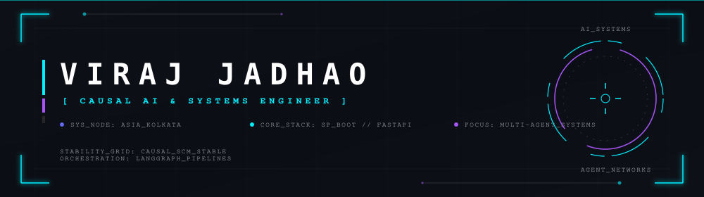

<!-- ============================================ -->
<!-- HUD HEADER SYSTEM -->
<!-- ============================================ -->
<p align="center">
  
</p>

<!-- DYNAMIC TELEMETRY TAGLINE -->
<p align="center">
  <a href="https://git.io/typing-svg">
    
  </a>
</p>

<!-- CORE CAPABILITY BADGES -->
<p align="center">
  
  
  
</p>

<!-- QUICK NAV -->
<p align="center">
  <a href="#️-currently-building">Projects</a> •
  <a href="#-architectural-stack--pipelines">Stack</a> •
  <a href="#-professional-experience">Experience</a> •
  <a href="#-telemetry-feeds-live-activity-metrics">Metrics</a> •
  <a href="#-uplink-portal">Contact</a>
</p>

<p align="center">
  
  
  
</p>

---

### 💻 SYSTEM ACTIVE // CORE STATUS

<p align="center">
  
</p>

---

## 🛠️ ARCHITECTURAL STACK & PIPELINES

<blockquote>
<b>Engineering Directive:</b> Build scalable, evidence-grounded AI systems from mathematical formulation up to containerized microservice architectures — full-stack, end to end.
</blockquote>

### 🧑‍💻 Core Languages
`Python` `Java` `TypeScript` `C++`

### 🧠 Agentic AI, Causal & Probabilistic Systems
* **Frameworks & Orchestration:** `LangGraph` | `LangChain` | `PyTorch` | `scikit-learn` | `Hugging Face Transformers`
* **Multi-Agent Pipelines:** sequential agent orchestration (5-stage LangGraph pipelines), schema-aware NL-to-SQL query generation, RAG citation grounding
* **Causal Inference *(in active development)*:** `DoWhy` | Structural Causal Models, ATE/CATE estimation, Rosenbaum bounds sensitivity analysis
* **Generative & Representation Learning:** LoRA adapter fine-tuning, conditional GANs (Pix2Pix U-Net/PatchGAN), text-to-image synthesis (Stable Diffusion), Neural Style Transfer (VGG-19 feature optimization), `sentence-transformers` embedding pipelines
* **Applied ML & Forecasting:** Isolation Forest anomaly detection, time-series risk/cash-flow forecasting, Facebook Prophet
* **Explainability & Trust:** SHAP feature attribution, entailment-based hallucination detection (NLI formulation), probabilistic calibration (ECE)

### 🎨 Frontend & Interactive UI
* **Core Frameworks:** `React` | `Next.js 15`
* **Styling & State Management:** `Tailwind CSS` | `Zustand`
* **Data Visualization & Motion:** `Recharts` | `D3.js` | `Plotly` | `Framer Motion`
* **UX Patterns:** live SSE-driven streaming interfaces, real-time geospatial dashboards, animated multi-step agent execution views

### ⚙️ Distributed Systems & Backend
* **Microservices:** `Spring Boot` (Java) | `FastAPI` (Python) | `Flask` | `Node.js`
* **APIs & Auth:** RESTful API design, JWT-based authentication, async request handling, schema validation
* **Architecture Patterns:** decoupled write-heavy ingestion vs. query-heavy retrieval pipelines, Server-Sent Events (SSE) streaming, asynchronous event brokers via Redis Streams, tri-service/multi-service orchestration
* **Infrastructure & Tooling:** `Docker` | `Docker Compose` | `Nginx` (SSL/TLS reverse proxying) | `Linux` | `Git`

### 🗄️ Database & Retrieval Engineering
* **Vector & Relational Engines:** `pgvector` (PostgreSQL) | `FAISS` (dense vector search) | `MongoDB` | `Redis` caching
* **Geospatial:** `PostGIS` | `Mapbox`
* **Search Paradigms:** hybrid sparse-dense index merging (BM25 + dense embeddings), sub-second semantic retrieval over multi-million-record clusters, schema-aware NL-to-SQL translation

---

## 🛰️ CURRENTLY BUILDING

## 🏥 AROGYARAKSHAK — AI-Driven Patient Advocacy Platform
> Final Year Project · Team of 5 · PES Modern College of Engineering, SPPU

Healthcare in India isn't hard because care is unavailable — it's hard because the paperwork *around* care is unreadable. One upload → three AI modules fight for you.

- 🧾 **BillNyay** — audits hospital bills against CGHS rates, drafts IRDAI-compliant appeal letters via a 5-agent pipeline
- 🏛️ **SchemeSetu** — RAG over PMJAY/MJPJAY scheme docs, tells you exactly which government scheme you qualify for
- 💊 **DawaCheck** — scans medicine strips, flags overcharging against NPPA ceiling prices, suggests generics
- 🔗 **Kadi** — the shared context layer linking all three across **English, Hindi & Marathi**, using transliteration + cross-lingual embeddings to match "क्रोसिन" to "Crocin" automatically

`FastAPI` `Next.js 15` `PostgreSQL` `pgvector` `FAISS` `Groq` `IndicXlit` `IndicSBERT` `Docker`

*(Private repo — docs maintained separately)*

---

## 🛡️ FINGUARD AI — Know Your Financial Future Before It Happens
> Viraj Jadhao + Bhumi · Mar–Jul 2026

Upload a bank statement → get a live Financial Risk Score (0-100) → simulate "what if I close this loan?" and watch your risk shift in real time.

- 🧠 91% accurate AI expense classification, trained on Indian bank statements
- 🎮 **Live scenario simulator** — drag a parameter, watch the risk score + 6-month cash flow forecast update instantly
- 📊 5-dimension composite risk index (liquidity, debt, volatility, savings, diversification)
- ⚡ 500 transactions classified in under 60 seconds, async end-to-end

`Spring Boot 3` `FastAPI` `React + TS` `PostgreSQL/pgvector` `Docker` `Nginx`

[](https://github.com/Viraj281105/Finguard-AI)

---

## 🔍 HALLUCINATION DETECTOR — Fact-Checking for LLM Output
> Backend live · Retriever + NLI dual-judge system

Treats "is this AI claim actually true" as a formal verification problem, not a vibe check — a retriever finds evidence, a specialized NLI model rules *Entails* or *Contradicts*.

- ⚖️ Dual-judge mode coming: fast (RoBERTa) vs. accurate (Mistral 7B) trade-off
- 🔌 Headless REST API — drop into any app
- 🏠 100% local vector KB (ChromaDB), zero external dependency
- 🚢 CI/CD, full test suite, one-command Docker deploy

`FastAPI` `ChromaDB` `RoBERTa-NLI` `SvelteKit` `Docker`

[](https://github.com/Viraj281105/AI-Hallucination-Detection-Application)

---

## 🏦 FIN INTELLIGENCE PLATFORM — Governed NL-to-SQL for Finance
> Scaffold complete · Security-first by design

Ask your financial database a question in plain English — safely. Every query is validated, explained, and audited before it ever touches real data.

- 🛡️ SQL injection + prompt-injection guardrails baked in, not bolted on
- 🔍 Every generated query ships with a **reasoning trace** — no black-box SQL
- 🔐 Multi-tenant RBAC + full audit logging for compliance review
- 📁 ADR-documented architecture (`docs/decisions/`)

`Python` `FastAPI` `HuggingFace Transformers` `Docker`

[](https://github.com/Viraj281105/fin-intelligence-platform)

---

## 💼 PROFESSIONAL EXPERIENCE

<details open>
<summary><b>🏢 SAS R&D — Customer Intelligence Department</b></summary>

> **Intern** · 11 months (Jul 2026 – present) · Full-time, paid

Working across a technical stack confidential to the role.

</details>

<details>
<summary><b>🤖 Prodigy InfoTech — Generative AI Intern</b></summary>

> **Remote** · Jan – Feb 2026

5 end-to-end generative AI builds, language + vision:
- Fine-tuned GPT-2 on a domain corpus; built N-gram Markov text generation from scratch (bigram → weighted n-gram)
- Built a conditional GAN (Pix2Pix, U-Net + PatchGAN) for facade segmentation; Neural Style Transfer via VGG-19; deployed Stable Diffusion for text-to-image

`Hugging Face` `GPT-2` `Pix2Pix (cGAN)` `Neural Style Transfer` `Stable Diffusion`

</details>
---

<!-- =========================================================
     TELEMETRY // GITHUB ACTIVITY
========================================================= -->

## `// TELEMETRY_FEED`

<div align="center">


</div>

<br/>

<table width="100%">
<tr>

<td width="50%" align="center">

### `01 // SYSTEM METRICS`


</td>

<td width="50%" align="center">

### `02 // STREAK PROTOCOL`


</td>

</tr>

<tr>

<td width="50%" align="center">

### `03 // LANGUAGE DISTRIBUTION`


</td>

<td width="50%" align="center">

### `04 // ACTIVITY STREAM`


</td>

</tr>
</table>

<br/>

<div align="center">

```text
┌──────────────────────────────────────────────────────────┐
│  TELEMETRY STATUS                                        │
│                                                          │
│  REPOSITORIES      ████████████████████  ONLINE          │
│  CONTRIBUTIONS     ███████████████████░  TRACKING        │
│  BUILD ACTIVITY    ████████████████████  ACTIVE          │
│  CODEBASE          ███████████████████░  EVOLVING        │
│                                                          │
│  STREAM :: GITHUB // REAL-TIME ENGINEERING ACTIVITY      │
└──────────────────────────────────────────────────────────┘

</div>
```

## `// ACHIEVEMENT_MATRIX`

<div align="center">


<br/>

<sub>

`RECOGNITION_LAYER // GITHUB ACHIEVEMENTS`

</sub>

</div>

---

## `// SYSTEM_COMPONENTS`

<div align="center">


<br/><br/>


<br/><br/>


<br/><br/>


<br/><br/>


</div>

---

## `// CONTRIBUTION_STREAM`

<div align="center">


<br/><br/>


<br/><br/>

<sub>

`CONTRIBUTION MATRIX // ACTIVITY STREAM // CONTINUOUS`

</sub>

<br/><br/>


&nbsp;

&nbsp;


</div>

---

## `// CREDENTIAL_DATABASE`

<div align="center">


<br/><br/>

<table width="100%">
<tr>

<td width="50%" valign="top">

### 🧠 `AI // INTELLIGENCE`

| Organization | Credential |
|:---|:---|
| **Google × Hack2Skill** | AI Agents Intensive · 5 Days |
| **AICTE × Google** | AI / ML Virtual Internship |
| **Google AI Adventures** | ML · DL · Generative AI |
| **HCL × GUVI** | AI / ML Certification |

</td>

<td width="50%" valign="top">

### ⚙️ `ENGINEERING // CLOUD`

| Organization | Credential |
|:---|:---|
| **AWS** | Cloud Foundations |
| **Prodigy InfoTech** | Generative AI Internship · 2026 |
| **IIT Bombay** | Core Java Certification |

</td>

</tr>
</table>

<br/>


</div>

---

## `// UPLINK_PORTAL`

<div align="center">


<br/><br/>

```text
┌──────────────────────────────────────────────────────┐
│                                                      │
│   INCOMING CONNECTIONS ACCEPTED                      │
│                                                      │
│   Looking to build something ambitious?              │
│   Let's establish a connection.                      │
│                                                      │
└──────────────────────────────────────────────────────┘
```
<br/>

<a href="mailto:viraj.jadhao28@gmail.com">
  
</a>

&nbsp;&nbsp;

<a href="https://www.linkedin.com/in/viraj-jadhao-0771b830b/">
  
</a>

&nbsp;&nbsp;

<a href="https://github.com/Viraj281105">
  
</a>

<br/><br/>

<sub>
CONNECTION SECURE // CHANNELS OPEN // ACCESS GRANTED
</sub>

</div>
