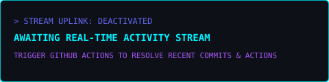
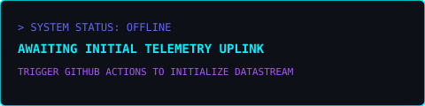
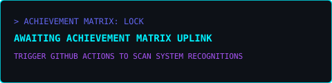

<!-- ============================================ -->
<!-- HUD HEADER SYSTEM -->
<!-- ============================================ -->
<p align="center">
  
</p>

<!-- DYNAMIC TELEMETRY TAGLINE -->
<p align="center">
  <a href="https://git.io/typing-svg">
    
  </a>
</p>

<!-- CORE CAPABILITY BADGES -->
<p align="center">
  
  
  
</p>

<!-- QUICK NAV -->
<p align="center">
  <a href="#-architectural_matrix">Architectures</a> •
  <a href="#-system_components">Stack</a> •
  <a href="#-experience_log">Experience</a> •
  <a href="#-telemetry_feed">Telemetry</a> •
  <a href="#-uplink_portal">Uplink</a>
</p>

<p align="center">
  
  
  
</p>

---

### `// SYSTEM DIAGNOSTICS: ACTIVE`

<p align="center">
  
</p>

---

## // ARCHITECTURAL_MATRIX

<table width="100%">
  <!-- ROW 1: AROGYARAKSHAK -->
  <tr>
    <td width="30%" valign="top" bgcolor="#0d1117" style="border: 1px solid #161b22; padding: 12px;">
      <code>PORT_ID :: 01</code><br/>
      <h3>ArogyaRakshak</h3>
      <span style="color: #52b788; font-weight: bold;">[ ● ONLINE ]</span><br/>
      <code>THROUGHPUT: HIGH</code><br/>
      <code>LATENCY: &lt;15s</code>
    </td>
    <td width="70%" valign="top" bgcolor="#0d1117" style="border: 1px solid #161b22; padding: 12px;">
      <p><i>Tri-service Indian healthcare compliance core auditing billing entries, mapping PMJAY aid schemes, and translating local dialects to standard medicine APIs.</i></p>
      <details>
        <summary><b style="color: #52b788; cursor: pointer;">[ + ] DEPLOY DIAGNOSTICS &amp; METRICS</b></summary>
        <br/>
        <b>Core Modules:</b>
        <ul>
          <li><b>BillNyay Module:</b> 5-agent LangGraph pipeline checking medical bills against CGHS ceiling benchmarks.</li>
          <li><b>SchemeSetu Module:</b> SBERT embedding matching using dense FAISS indexes over government PMJAY criteria.</li>
          <li><b>DawaCheck Module:</b> LayoutLMv3 classification identifying medicine names and ceiling pricing bounds.</li>
          <li><b>Kadi Router:</b> Dynamic transliteration layer binding local names (e.g. "क्रोसिन") to clinical entities ("Crocin").</li>
        </ul>
        <b>Signal Routing Topology:</b>
        <pre>
┌──────────────┐      ┌─────────────┐      ┌─────────────────────┐
│ Ingestion PDF│ ──&gt;  │ Kadi Router │ ──&gt;  │ 5-Agent LangGraph   │
└──────────────┘      └─────────────┘      └─────────────────────┘
                             │
                             └──&gt;  │ FAISS Vector Search │
                                   └─────────────────────┘
        </pre>
        <code>STACK: FastAPI · Next.js 15 · PostgreSQL/pgvector · FAISS · IndicSBERT · Docker</code>
      </details>
    </td>
  </tr>

  <!-- ROW 2: FINGUARD AI -->
  <tr>
    <td width="30%" valign="top" bgcolor="#0d1117" style="border: 1px solid #161b22; padding: 12px;">
      <code>PORT_ID :: 02</code><br/>
      <h3>FinGuard AI</h3>
      <span style="color: #52b788; font-weight: bold;">[ ● ONLINE ]</span><br/>
      <code>THROUGHPUT: ASYNC</code><br/>
      <code>BATCH_SIZE: 500+</code>
    </td>
    <td width="70%" valign="top" bgcolor="#0d1117" style="border: 1px solid #161b22; padding: 12px;">
      <p><i>Asynchronous transactional risk engine simulating loan cancellations and predicting 6-month cash-flow stability matrices across 700K+ transactional records.</i></p>
      <details>
        <summary><b style="color: #52b788; cursor: pointer;">[ + ] DEPLOY DIAGNOSTICS &amp; METRICS</b></summary>
        <br/>
        <b>Core Capabilities:</b>
        <ul>
          <li><b>Risk Indexing:</b> Calculates default likelihoods on 5 distinct dimensions (liquidity, debt, volatility, savings, diversification).</li>
          <li><b>Policy Simulator:</b> Interactive SCM engine enabling real-time counterfactual policy tests.</li>
          <li><b>Async Processing:</b> Leverages decoupled pipelines executing statement analysis in &lt;60 seconds.</li>
        </ul>
        <b>Repository Link:</b><br/>
        <a href="https://github.com/Viraj281105/Finguard-AI">
          
        </a>
        <br/><br/>
        <code>STACK: Spring Boot 3 · FastAPI · React · PostgreSQL/pgvector · Docker · Nginx</code>
      </details>
    </td>
  </tr>

  <!-- ROW 3: FACT-GROUNDER -->
  <tr>
    <td width="30%" valign="top" bgcolor="#0d1117" style="border: 1px solid #161b22; padding: 12px;">
      <code>PORT_ID :: 03</code><br/>
      <h3>Fact-Grounder</h3>
      <span style="color: #52b788; font-weight: bold;">[ ● ACTIVE ]</span><br/>
      <code>CALIBRATION: ECE 0.07</code><br/>
      <code>JUDGES: DUAL</code>
    </td>
    <td width="70%" valign="top" bgcolor="#0d1117" style="border: 1px solid #161b22; padding: 12px;">
      <p><i>Factual validation compiler translating generation checks into formal Natural Language Inference (NLI) formulations.</i></p>
      <details>
        <summary><b style="color: #52b788; cursor: pointer;">[ + ] DEPLOY DIAGNOSTICS &amp; METRICS</b></summary>
        <br/>
        <b>System Performance:</b>
        <ul>
          <li><b>Expected Calibration Error:</b> Suppressed error scores from 0.23 down to 0.07.</li>
          <li><b>Asymmetric Judges:</b> Entailment tests run on specialized DeBERTa models vs Mistral 7B pipelines.</li>
          <li><b>Integration:</b> Exposes headless endpoints for zero-latency RAG citation grounding.</li>
        </ul>
        <b>Repository Link:</b><br/>
        <a href="https://github.com/Viraj281105/AI-Hallucination-Detection-Application">
          
        </a>
        <br/><br/>
        <code>STACK: FastAPI · ChromaDB · RoBERTa-NLI · SvelteKit · Docker</code>
      </details>
    </td>
  </tr>

  <!-- ROW 4: FIN INTELLIGENCE -->
  <tr>
    <td width="30%" valign="top" bgcolor="#0d1117" style="border: 1px solid #161b22; padding: 12px;">
      <code>PORT_ID :: 04</code><br/>
      <h3>Fin Intel</h3>
      <span style="color: #52b788; font-weight: bold;">[ ● ACTIVE ]</span><br/>
      <code>COMPILER: NL-SQL</code><br/>
      <code>SEC: INJECTION_BLOCKED</code>
    </td>
    <td width="70%" valign="top" bgcolor="#0d1117" style="border: 1px solid #161b22; padding: 12px;">
      <p><i>Governed text-to-SQL execution engine generating reasoned, injection-proof database queries.</i></p>
      <details>
        <summary><b style="color: #52b788; cursor: pointer;">[ + ] DEPLOY DIAGNOSTICS &amp; METRICS</b></summary>
        <br/>
        <b>Governance Rules:</b>
        <ul>
          <li><b>Query Tracing:</b> Generates full step-by-step reasoning maps before execution.</li>
          <li><b>Injection Shielding:</b> Pre-validation structures blocking context escape vectors.</li>
          <li><b>Compliance:</b> Audit logging and role-based access tokens hardcoded in service nodes.</li>
        </ul>
        <b>Repository Link:</b><br/>
        <a href="https://github.com/Viraj281105/fin-intelligence-platform">
          
        </a>
        <br/><br/>
        <code>STACK: Python · FastAPI · HuggingFace Transformers · Docker</code>
      </details>
    </td>
  </tr>

  <!-- ROW 5: EDGE AI -->
  <tr>
    <td width="30%" valign="top" bgcolor="#0d1117" style="border: 1px solid #161b22; padding: 12px;">
      <code>PORT_ID :: 05</code><br/>
      <h3>Edge AI</h3>
      <span style="color: #52b788; font-weight: bold;">[ ● FIRMWARE ]</span><br/>
      <code>SILICON: ARTIX-7</code><br/>
      <code>LATENCY: &lt;10ms</code>
    </td>
    <td width="70%" valign="top" bgcolor="#0d1117" style="border: 1px solid #161b22; padding: 12px;">
      <p><i>ECG diagnostic processor utilizing quantized 1D CNN models compiled directly into FPGA gate-arrays.</i></p>
      <details>
        <summary><b style="color: #52b788; cursor: pointer;">[ + ] DEPLOY DIAGNOSTICS &amp; METRICS</b></summary>
        <br/>
        <b>Hardware Specifications:</b>
        <ul>
          <li><b>Model Quantization:</b> INT8 weights optimized for resource-constrained FPGA slices.</li>
          <li><b>Clock Speed:</b> Synchronized at 100MHz on Artix-7 fabric.</li>
          <li><b>Power Envelope:</b> Ultra-efficient run cycles consuming &lt;50mW total draw.</li>
        </ul>
        <code>STACK: Xilinx Vivado · Artix-7 FPGA · 1D CNN · INT8 Quantization</code>
      </details>
    </td>
  </tr>
</table>

---

## // EXPERIENCE_LOG

<details open>
  <summary><b style="color: #52b788; font-size: 16px; cursor: pointer;">🏢 SAS R&D — Customer Intelligence Department</b></summary>
  <p style="padding-left: 16px;">
    <b>Position:</b> AI Software Engineer Intern <br/>
    <b>Tenure:</b> <i>Jul 2026 – Present</i> · Pune, India <br/>
    <code>STATUS: ACTIVE</code>
  </p>
  <blockquote style="margin-left: 16px;">
    Developing and deploying production-grade data pipelines and systems within confidential SaaS customer intelligence suites.
  </blockquote>
</details>

<br/>

<details>
  <summary><b style="color: #52b788; font-size: 16px; cursor: pointer;">🤖 Prodigy InfoTech — Generative AI Intern</b></summary>
  <p style="padding-left: 16px;">
    <b>Position:</b> Core AI Intern <br/>
    <b>Tenure:</b> <i>Jan – Feb 2026</i> · Remote <br/>
    <code>STATUS: ARCHIVED</code>
  </p>
  <blockquote style="margin-left: 16px;">
    Built and deployed 5 end-to-end generative models, spanning text (fine-tuning GPT-2) and vision architectures (cGAN facade segmenters, VGG-19 neural style transfer, and Stable Diffusion).
  </blockquote>
</details>

---

## // SYSTEM_COMPONENTS

<table width="100%">
<tr>
<td width="25%" valign="top">

### 💻 LANGUAGES
- **Python**
- **Java**
- **C++**
- **TypeScript**
- **Go**

</td>
<td width="25%" valign="top">

### ⚙️ BACKEND
- **FastAPI**
- **Spring Boot**
- **Node.js**

</td>
<td width="25%" valign="top">

### 🎨 FRONTEND
- **React**
- **Next.js**
- **Tailwind CSS**

</td>
<td width="25%" valign="top">

### 🗄️ INFRASTRUCTURE
- **PostgreSQL**
- **Redis**
- **MongoDB**
- **Docker**
- **Nginx**
- **Linux**
- **Git**
- **AWS**

</td>
</tr>
</table>

<br/>

<div align="center">

</div>

---

## // TELEMETRY_FEED

<div align="center">


</div>

<br/>

<table width="100%">
<tr>
<td width="50%" align="center" valign="top">

### // SYSTEM_METRICS


</td>
<td width="50%" align="center" valign="top">

### // ACTIVITY_STREAM



</td>
</tr>
<tr>
<td width="50%" align="center" valign="top">

### // LANGUAGE_DISTRIBUTION



</td>
<td width="50%" align="center" valign="top">

### // TELEMETRY_STATUS

```text
┌──────────────────────────────────────────────────────────┐
│  TELEMETRY STATUS                                        │
│                                                          │
│  REPOSITORIES      ████████████████████  ONLINE          │
│  CONTRIBUTIONS     ███████████████████░  TRACKING        │
│  BUILD ACTIVITY    ████████████████████  ACTIVE          │
│  CODEBASE          ███████████████████░  EVOLVING        │
│                                                          │
│  STREAM :: GITHUB // REAL-TIME ENGINEERING ACTIVITY      │
└──────────────────────────────────────────────────────────┘
```

</td>
</tr>
</table>

<br/>

## // ACHIEVEMENT_MATRIX

<div align="center">



<br/>

<sub>

RECOGNITION_LAYER // GITHUB ACHIEVEMENTS

</sub>

</div>

---

## // CONTRIBUTION_STREAM

<div align="center">


<br/><br/>

<sub>

CONTRIBUTION MATRIX // ACTIVITY STREAM // CONTINUOUS

</sub>

<br/><br/>


&nbsp;

&nbsp;


</div>

---

## // CREDENTIAL_DATABASE

<table width="100%">
<tr>
<td width="50%" valign="top">

### 🧠 AI // INTELLIGENCE
- **Google × Hack2Skill** — AI Agents Intensive
- **AICTE × Google** — AI / ML Virtual Internship
- **Google AI Adventures** — ML / DL / GenAI
- **HCL × GUVI** — AI / ML Certification

</td>
<td width="50%" valign="top">

### ⚙️ ENGINEERING // CLOUD
- **AWS** — Cloud Foundations
- **Prodigy InfoTech** — Generative AI Internship · 2026
- **IIT Bombay** — Core Java Certification

</td>
</tr>
</table>

<br/>

<div align="center">

</div>

---

## // UPLINK_PORTAL

<div align="center">


<br/><br/>

<a href="mailto:viraj.jadhao28@gmail.com">
  
</a>

&nbsp;&nbsp;

<a href="https://www.linkedin.com/in/viraj-jadhao-0771b830b/">
  
</a>

&nbsp;&nbsp;

<a href="https://github.com/Viraj281105">
  
</a>

<br/><br/>

<sub>
CONNECTION SECURE // CHANNELS OPEN // ACCESS GRANTED
</sub>

</div>
