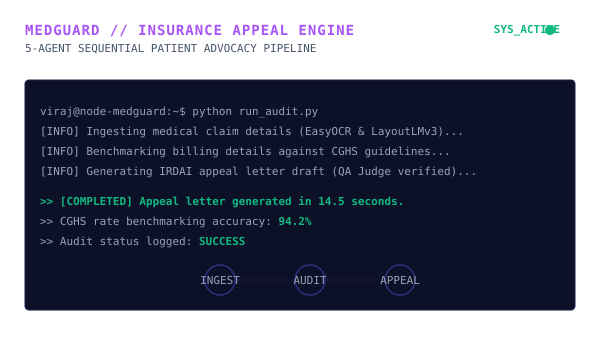
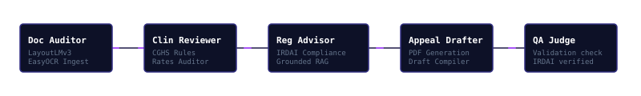
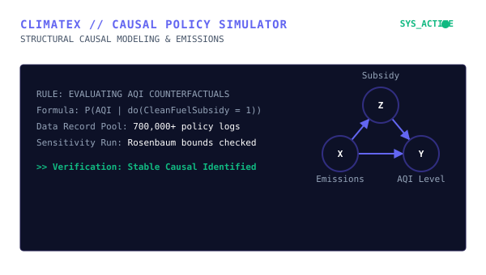
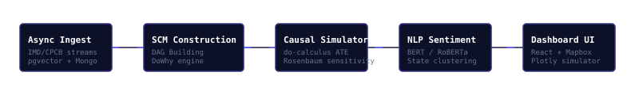
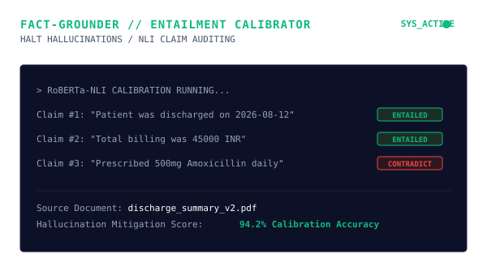
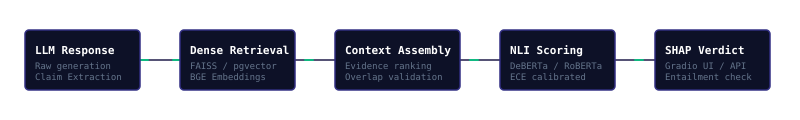
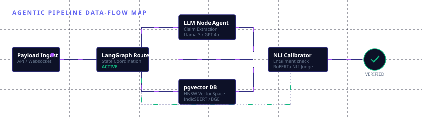
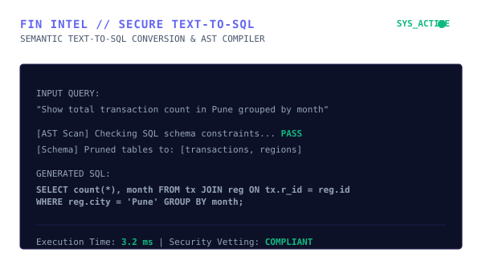
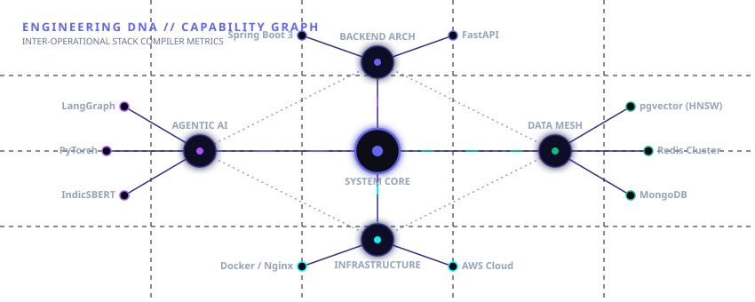

  

  

## 🧬 AI Systems & Causal AI Engineer

I build production-grade AI systems, multi-agent architectures, and causal inference frameworks. My focus is on engineering high-throughput backend services, robust retrieval pipelines, and stateful agentic reasoning loops that operate under strict validation, calibration, and security guardrails.

---

## 🏆 Selected Projects

<table width="100%" style="border-collapse: collapse; border: none; background: #070913;">
  
  <!-- Project 1: MedGuard -->
  <tr style="border: 1px solid #1e1b4b;">
    <td width="42%" style="padding: 12px; vertical-align: middle; background: #070913;">
      
    </td>
    <td width="58%" style="padding: 15px; vertical-align: top; background: #070913; color: #a5b4fc; font-family: sans-serif;">
      <h3 style="color: #a855f7; margin-top: 0; font-family: monospace; font-size: 16px;">🩺 MedGuard — AI Medical Billing Auditor &amp; Appeal Engine</h3>
      

        <strong>Description:</strong> AI medical billing auditor and appeal compiler leveraging a multi-agent sequential pipeline to enforce regulatory rates.
      

      <ul style="font-size: 13px; line-height: 1.5; color: #94a3b8; margin-bottom: 12px; padding-left: 20px;">
        <li>5-agent sequential LangGraph pipeline coordinating layout extraction, benchmarking, and appeal drafting.</li>
        <li>Benchmarks extracted items against ~10,000 official CGHS guidelines using similarity search.</li>
        <li>Generates IRDAI-compliant regulatory appeal letters as downloadable PDFs in under 15 seconds.</li>
      </ul>
      

        LangGraph
        FastAPI
        LayoutLMv3
        PostgreSQL
      

      

        🏆 <strong>Result:</strong> Top 3 Placement at Nexus 2.0 Hackathon (94% audit accuracy)
      

      <a href="https://github.com/Viraj281105/MedGuard" style="text-decoration: none; font-family: monospace; font-size: 12px; color: #10b981; font-weight: bold;">[VIEW REPOSITORY ➔]</a>
    </td>
  </tr>
</table>

  

---

<table width="100%" style="border-collapse: collapse; border: none; background: #070913;">
  
  <!-- Project 2: ClimateX -->
  <tr style="border: 1px solid #1e1b4b;">
    <td width="42%" style="padding: 12px; vertical-align: middle; background: #070913;">
      
    </td>
    <td width="58%" style="padding: 15px; vertical-align: top; background: #070913; color: #a5b4fc; font-family: sans-serif;">
      <h3 style="color: #6366f1; margin-top: 0; font-family: monospace; font-size: 16px;">🌀 ClimateX — India Climate Intelligence Platform</h3>
      

        <strong>Description:</strong> Causal AI and policy simulation platform estimating treatment effects (ATE/CATE) under latent confounding.
      

      <ul style="font-size: 13px; line-height: 1.5; color: #94a3b8; margin-bottom: 12px; padding-left: 20px;">
        <li>Causal graphs and structural equation models verified using backdoor/frontdoor identifiability criteria.</li>
        <li>Estimators feature <code>do(X = x)</code> intervention semantics and Rosenbaum bounds sensitivity analysis.</li>
        <li>Integrates RAG over MoEFCC/UN policy documents and live sentiment analysis (BERT/RoBERTa) over news feeds.</li>
      </ul>
      

        DoWhy
        FastAPI
        pgvector
        Mapbox
      

      

        ⚡ <strong>Result:</strong> Ingestion pipelines scaled over 700K+ records with sub-second semantic retrieval
      

      <a href="https://github.com/Viraj281105/ClimateX" style="text-decoration: none; font-family: monospace; font-size: 12px; color: #10b981; font-weight: bold;">[VIEW REPOSITORY ➔]</a>
    </td>
  </tr>
</table>

  

---

<table width="100%" style="border-collapse: collapse; border: none; background: #070913;">
  
  <!-- Project 3: Hallucination Detection -->
  <tr style="border: 1px solid #1e1b4b;">
    <td width="42%" style="padding: 12px; vertical-align: middle; background: #070913;">
      
    </td>
    <td width="58%" style="padding: 15px; vertical-align: top; background: #070913; color: #a5b4fc; font-family: sans-serif;">
      <h3 style="color: #10b981; margin-top: 0; font-family: monospace; font-size: 16px;">🔍 LLM Hallucination Detection — Verification Pipeline</h3>
      

        <strong>Description:</strong> Calibrated conditional inference NLI retriever-judge pipeline designed to evaluate and mitigate LLM hallucinations.
      

      <ul style="font-size: 13px; line-height: 1.5; color: #94a3b8; margin-bottom: 12px; padding-left: 20px;">
        <li>Formulates hallucination detection as conditional entailment estimation: <code>P(entailment | evidence, claim)</code>.</li>
        <li>Fine-tunes DeBERTa-based NLI classifiers on domain-adapted QA corpora for high-fidelity reasoning.</li>
        <li>Measures Expected Calibration Error (ECE) and applies post-hoc temperature scaling calibration.</li>
      </ul>
      

        DeBERTa
        FastAPI
        ChromaDB
        SHAP
      

      

        📉 <strong>Result:</strong> Reduced Expected Calibration Error (ECE) from 0.23 to 0.07 on TruthfulQA
      

      <a href="https://github.com/Viraj281105/AI-Hallucination-Detection-Application" style="text-decoration: none; font-family: monospace; font-size: 12px; color: #10b981; font-weight: bold;">[VIEW REPOSITORY ➔]</a>
    </td>
  </tr>
</table>

  

---

<table width="100%" style="border-collapse: collapse; border: none; background: #070913;">
  
  <!-- Project 4: ArogyaRakshak -->
  <tr style="border: 1px solid #1e1b4b;">
    <td width="42%" style="padding: 12px; vertical-align: middle; background: #070913;">
      
    </td>
    <td width="58%" style="padding: 15px; vertical-align: top; background: #070913; color: #a5b4fc; font-family: sans-serif;">
      <h3 style="color: #6366f1; margin-top: 0; font-family: monospace; font-size: 16px;">🏥 ArogyaRakshak — AI-Driven Patient Advocacy Platform</h3>
      

        <strong>Description:</strong> Trilingual patient advocacy console combining PMJAY/MJPJAY scheme mapping and NPPA medicine price audits.
      

      <ul style="font-size: 13px; line-height: 1.5; color: #94a3b8; margin-bottom: 12px; padding-left: 20px;">
        <li>Integrates BillNyay (claims audit), SchemeSetu (eligibility RAG), and DawaCheck (Schedule-I medicine price verification).</li>
        <li>Employs Kadi context layer managing trilingual phonetic transliteration (IndicXlit) and cross-lingual embeddings (IndicSBERT).</li>
        <li>Restricts data sharing across service boundaries using granular, user-consented operational scopes.</li>
      </ul>
      

        FastAPI
        Next.js 15
        PostgreSQL
        IndicSBERT
      

      

        🎓 <strong>Result:</strong> PES Modern College final year research project achieving >95% procedure extraction accuracy
      

      [🔒 PRIVATE REPOSITORY]
    </td>
  </tr>
</table>

---

<table width="100%" style="border-collapse: collapse; border: none; background: #070913;">
  
  <!-- Project 5: FinGuard AI -->
  <tr style="border: 1px solid #1e1b4b;">
    <td width="42%" style="padding: 12px; vertical-align: middle; background: #070913;">
      
    </td>
    <td width="58%" style="padding: 15px; vertical-align: top; background: #070913; color: #a5b4fc; font-family: sans-serif;">
      <h3 style="color: #00f5ff; margin-top: 0; font-family: monospace; font-size: 16px;">🏦 FinGuard AI — Financial Text-to-SQL Engine</h3>
      

        <strong>Description:</strong> Governed Natural Language-to-SQL engine featuring schema-aware query sanitization and secure parameterized execution.
      

      <ul style="font-size: 13px; line-height: 1.5; color: #94a3b8; margin-bottom: 12px; padding-left: 20px;">
        <li>Direct translation from Natural Language to database queries using fine-tuned RAG models.</li>
        <li>Audit layer enforces query validation, AST sanitization, and compliance reviews before execution.</li>
        <li>Parameterized statement builder isolates execution to completely prevent SQL injection attacks.</li>
      </ul>
      

        Python
        FastAPI
        Transformers
        Docker
      

      

        🛡️ <strong>Result:</strong> Pre-execution AST governance preventing PII leaks and un-audited database transactions
      

      <a href="https://github.com/Viraj281105/fin-intelligence-platform" style="text-decoration: none; font-family: monospace; font-size: 12px; color: #10b981; font-weight: bold;">[VIEW REPOSITORY ➔]</a>
    </td>
  </tr>
</table>

---

## 🛠 Core Stack & Architecture DNA

The graph below maps the interconnected architectures of my technical stack:

  

| Layer | Core Technologies | Focus & Methodology |
|---|---|---|
| **Languages** | `Python` · `Java` · `Go` · `TypeScript` · `C++` | Object-oriented design, concurrent patterns, type-safety |
| **AI & ML** | `LangGraph` · `DoWhy` · `PyTorch` · `DeBERTa` · `Transformers` | Multi-agent loops, Causal SEMs, NLI calibration, SHAP explainability |
| **Backend & Ingestion** | `FastAPI` · `Spring Boot` · `Docker` · `Nginx` | Microservices, Server-Sent Events (SSE), reverse proxy, API gate keeping |
| **Database & Search** | `PostgreSQL` · `pgvector` · `FAISS` · `ChromaDB` · `Redis` | Hybrid dense-sparse search, vector indices (HNSW), geospatial querying |

---

## 💼 Professional Experience

**SAS R&D** | *Customer Intelligence Intern* | **July 2026 – Present**
* Engineering enterprise customer intelligence and analytics services across a confidential cloud stack.

**Prodigy InfoTech** | *Generative AI Intern* | **Jan 2026 – Feb 2026**
* Developed conditional GANs (U-Net + PatchGAN) for facade segmentation, VGG-19 Neural Style Transfer, and Stable Diffusion models.
* Fine-tuned text generation models (GPT-2) using Hugging Face Transformers and implemented bigram/weighted Markov text chains from scratch.

---

## 📊 GitHub Activity

The matrix below captures active commit streams, language distributions, and telemetry metrics compiled from my active development repositories:

<table width="100%" style="border-collapse: collapse; border: none; background: #070913; width: 100%;">
  <tr>
    <td width="50%" style="border: 1px solid #1e1b4b; padding: 15px; vertical-align: top; border-radius: 8px;">
      <h4 style="color: #6366f1; margin-top: 0; font-family: monospace; font-size: 12px; text-transform: uppercase;">📊 Telemetry Metrics</h4>
      
    </td>
    <td width="50%" style="border: 1px solid #1e1b4b; padding: 15px; vertical-align: top; border-radius: 8px;">
      <h4 style="color: #a855f7; margin-top: 0; font-family: monospace; font-size: 12px; text-transform: uppercase;">⚡ Commit Stream Activity</h4>
      
    </td>
  </tr>
  <tr>
    <td width="50%" style="border: 1px solid #1e1b4b; padding: 15px; vertical-align: top; border-radius: 8px;">
      <h4 style="color: #10b981; margin-top: 0; font-family: monospace; font-size: 12px; text-transform: uppercase;">🎛 Language Distribution</h4>
      
    </td>
    <td width="50%" style="border: 1px solid #1e1b4b; padding: 15px; vertical-align: top; border-radius: 8px;">
      <h4 style="color: #00f5ff; margin-top: 0; font-family: monospace; font-size: 12px; text-transform: uppercase;">🏆 Achievement Matrix</h4>
      
    </td>
  </tr>
</table>

---

  

## 🤝 Connect

  
  &nbsp;
  
  &nbsp;
  

