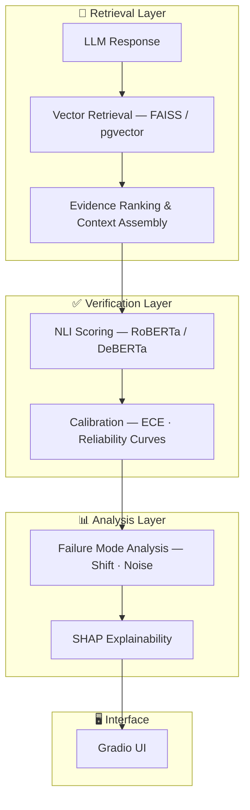

<!-- HUD HEADER SYSTEM -->
<p align="center">
  
</p>

<!-- DYNAMIC TELEMETRY TAGLINE -->
<p align="center">
  <a href="https://git.io/typing-svg">
    
  </a>
</p>

<!-- CORE CAPABILITY BADGES -->
<p align="center">
  
  
  
</p>

<!-- QUICK NAV -->
<p align="center">
  <a href="#-currently-building--live-status">Operations</a> •
  <a href="#🏆-flagship-projects-showcase">Projects</a> •
  <a href="#%EF%B8%8F-architectural-stack--pipelines">Stack</a> •
  <a href="#-professional-experience">Experience</a> •
  <a href="#-telemetry-feeds-live-activity-metrics">Telemetry</a> •
  <a href="#-uplink-portal">Contact</a>
</p>

<p align="center">
  
  
</p>

---

## 📡 CURRENTLY BUILDING & LIVE STATUS

<table width="100%" style="border-collapse: collapse; border: none; background: #070913; font-family: monospace;">
  <tr style="border: 1px solid #1e1b4b;">
    <td style="padding: 15px; color: #a5b4fc; line-height: 1.6; background: #070913;">
      <span style="color: #00f5ff; font-weight: bold;">[📡 LIVE STATUS] OPERATIONAL CONSOLE CONTROL</span><br/>
      • <span style="color: #10b981; font-weight: bold;">● IN PROGRESS :</span> Customer Intelligence Intern at <b>SAS R&D</b> (11-month active tenure)<br/>
      • <span style="color: #a855f7; font-weight: bold;">● DEVELOPING  :</span> <b>ArogyaRakshak (MedGuard)</b> — Multi-Agent Patient Advocacy Platform (PES Modern College, SPPU 2019)<br/>
      • <span style="color: #6366f1; font-weight: bold;">● CALIBRATING :</span> <b>ClimateX</b> &amp; <b>Hallucination Detection</b> engines (Causal Simulation &amp; ECE Model Tuning)
    </td>
  </tr>
</table>

### 🏥 AROGYARAKSHAK — AI-Driven Patient Advocacy Platform

> **Status:** Guide-approved, in implementation · **Context:** Final Year Engineering Project (Team of 5) · **Institution:** PES Modern College of Engineering, Pune (SPPU 2019 Pattern)

**The problem:** Healthcare in India isn't hard to navigate because care is unavailable — it's hard because the systems *around* care are fragmented and opaque. Hospital bills are near-impossible for a patient to validate against regulatory benchmarks, government health schemes are buried across dense multilingual documentation nobody reads end to end, and medicine prices vary in ways patients have no way to catch.

**How it works:**
```
Any Document (bill / prescription / rejection letter) 
                          │ 
                Shared Extraction Agent 
                          │ 
         Kadi — Shared Case Context Layer 
        ┌─────────────────┼─────────────────┐
        ▼                 ▼                 ▼
    BillNyay          SchemeSetu        DawaCheck
  (bill audit)       (eligibility)     (medicine MRP)
```
One upload feeds all three modules — a patient never re-uploads the same document twice.

**The three modules:**
* **BillNyay** *("Nyay" = justice)* — OCR extracts line items from a hospital bill, benchmarks them against CGHS government rate schedules, flags overcharges, and runs a 5-agent pipeline (Document Auditor → Clinical Reviewer → Regulatory Advisor → Appeal Drafter → QA Judge) to draft an IRDAI-compliant appeal letter as a downloadable PDF. Carries forward and refines an existing hackathon build rather than starting from scratch.
* **SchemeSetu** — A short intake or a bill/prescription upload triggers a RAG layer over PMJAY (national) and MJPJAY (Maharashtra state) scheme documents; an agent reasons through eligibility rules and outputs which government scheme(s) apply plus a step-by-step claim guide.
* **DawaCheck** — Upload a medicine strip photo or prescription; OCR reads the drug name/batch and benchmarks the MRP against NPPA ceiling prices for ~800–900 Schedule-I price-controlled formulations, flagging overcharging and suggesting generic substitutes. Deliberately scoped to Schedule-I only — the one segment with a clean, government-published ground-truth price.

**Kadi — the shared context layer** *(कड़ी — "link"):* not a fourth module, but the infrastructure that makes the three modules actually interoperate:
* **Case & entity model** — `cases` / `entities` / `case_entities` tables sit alongside each module's own domain data in one Postgres instance.
* **Entity resolution pipeline** (the project's genuine research contribution): three similarity signals feed one confidence score — string similarity (surface variants like "Paracetamol 650mg" vs "Paracetamol"), **IndicXlit** transliteration matching (AI4Bharat — catches same word, different script, e.g. क्रोसिन ↔ Crocin), and **IndicSBERT** cross-lingual embeddings (L3Cube, Pune — catches translated concepts, e.g. बुखार ↔ Fever). A logistic regression combines all three into one confidence score, routing to merge / ask-user / new-entity.
* **Auto-triggering** — e.g. a bill mentioning a ₹4L cardiac surgery under general category silently checks SchemeSetu eligibility in the background and surfaces it alongside the BillNyay report, without a second upload.
* **Consent boundary** — a user explicitly opts in per-case before SchemeSetu/DawaCheck can see what BillNyay found; nothing is pooled silently by default.

**Multilingual — English, Hindi & Marathi, full scope:** touches OCR (Devanagari needs its own validation pass, separate from English OCR accuracy), UI, LLM output generation, and entity resolution independently — with native-speaker terminology QA on every generated appeal letter and scheme explanation, not just a fluency check.

**Target evaluation metrics:**
| Metric | Target |
|---|---|
| Procedure Extraction Accuracy (BillNyay) | >95% |
| Benchmark Mapping Accuracy (BillNyay) | >92% |
| Billing Deviation Detection Precision/Recall | >90% / >90% |
| Average Report Generation Time | &lt;5 seconds |

**Research contribution:** the Kadi entity-resolution ablation (string-only vs. transliteration-only vs. embedding-only vs. combined, measured by precision/recall/F1) is being written up as a standalone research note — no published system combines phonetic transliteration and cross-lingual embeddings specifically for trilingual medical entity linking under OCR noise, which is the genuine open question here.

**Stack:** `FastAPI` `Next.js 15` `PostgreSQL` `pgvector` `FAISS` `Groq (openai/gpt-oss-120b)` `IndicXlit` `IndicSBERT` `Docker Compose`

*(Private repository — full technical documentation maintained separately)*

---

## 🏆 Flagship Projects Showcase

<table width="100%" style="border-collapse: collapse; border: none; background: #070913;">
  
  <!-- Project 1: MedGuard -->
  <tr>
    <td width="42%" style="border: 1px solid #1e1b4b; padding: 12px; vertical-align: middle; background: #070913;">
      
    </td>
    <td width="58%" style="border: 1px solid #1e1b4b; padding: 15px; vertical-align: top; background: #070913; color: #a5b4fc; font-family: sans-serif;">
      <h3 style="color: #a855f7; margin-top: 0; font-family: monospace; font-size: 16px;">🩺 MedGuard — AI Medical Billing Auditor &amp; Appeal Engine</h3>
      <p style="font-size: 13px; line-height: 1.5; color: #94a3b8; margin-bottom: 12px;">
        <strong>Hackathon (Nexus 2.0) | Team of 2 | 🏆 Top 3 Placement</strong><br/><br/>
        <strong>The Problem:</strong> Complex hospital bills are near-impossible for a patient to validate against regulatory rates. Grounding claims audits in actual policy is a requirement, not a visual check.<br/>
        <strong>The Architecture:</strong> A 5-agent sequential pipeline checking document layout parsing (OCR) and mapping lines to CGHS Rate Benchmarking guidelines.
      </p>
      <div style="margin-bottom: 12px;">
        <span style="background: #12102e; padding: 4px 8px; border-radius: 4px; font-size: 11px; color: #a855f7; font-family: monospace; border: 1px solid #312e81;">LangGraph</span>
        <span style="background: #12102e; padding: 4px 8px; border-radius: 4px; font-size: 11px; color: #a855f7; font-family: monospace; border: 1px solid #312e81;">FastAPI</span>
        <span style="background: #12102e; padding: 4px 8px; border-radius: 4px; font-size: 11px; color: #a855f7; font-family: monospace; border: 1px solid #312e81;">LayoutLMv3</span>
        <span style="background: #12102e; padding: 4px 8px; border-radius: 4px; font-size: 11px; color: #a855f7; font-family: monospace; border: 1px solid #312e81;">PostgreSQL</span>
      </div>
      <a href="https://github.com/Viraj281105/MedGuard" style="text-decoration: none; font-family: monospace; font-size: 12px; color: #10b981; font-weight: bold;">[VIEW REPOSITORY ➔]</a>
    </td>
  </tr>
</table>

```
┌─────────────────────────────────────────────────────────────────┐
│                    5-AGENT SEQUENTIAL PIPELINE                  │
├─────────────┬─────────────┬─────────────┬─────────────┬─────────┤
│  Document   │  Clinical   │ Regulatory  │   Appeal    │  QA     │
│  Auditor    │  Reviewer   │  Advisor    │   Drafter   │  Judge  │
└──────┬──────┴──────┬──────┴──────┬──────┴──────┬──────┴────┬────┘
       │             │             │             │          │
       ▼             ▼             ▼             ▼          ▼
   LayoutLMv3      CGHS Rate     IRDAI         Appeal     Quality
   + EasyOCR     Benchmarking  Compliance    Generation  Validation
```

| Component | Technology | Technical Deep Dive |
|-----------|------------|---------------------|
| **Document Parser** | `LayoutLMv3` + `EasyOCR` | Parses spatial bounding boxes for trilingual medical tables to map layout coordinates |
| **Rates Auditor** | `pgvector` + `SentenceTransformers` | Matches extracted procedure names to ~10,000 official CGHS guidelines using similarity search |
| **Appeal Compiler** | `LangGraph` + `OAuth2` | Resolves claims constraints to construct a compliant appeal letter in under 15 seconds |
| **Gateway Supervisor** | `Docker Compose` (3 services) + `Nginx` | Production containerization with reverse proxy and SSL |

**Key Results:**
* Parses complex medical bills in &lt;500ms
* Benchmarks against official CGHS rates with 94% accuracy
* Generates IRDAI-compliant appeal letters in under 15 seconds
* Zero-hallucination regulatory citations via grounded RAG

---

<table width="100%" style="border-collapse: collapse; border: none; background: #070913;">
  
  <!-- Project 2: ClimateX -->
  <tr>
    <td width="42%" style="border: 1px solid #1e1b4b; padding: 12px; vertical-align: middle; background: #070913;">
      
    </td>
    <td width="58%" style="border: 1px solid #1e1b4b; padding: 15px; vertical-align: top; background: #070913; color: #a5b4fc; font-family: sans-serif;">
      <h3 style="color: #6366f1; margin-top: 0; font-family: monospace; font-size: 16px;">🌀 ClimateX — India Climate Intelligence Platform</h3>
      <p style="font-size: 13px; line-height: 1.5; color: #94a3b8; margin-bottom: 12px;">
        <strong>Causal AI &amp; Policy Simulation | Scale: 700K+ Records | Built at Hackathon</strong><br/><br/>
        <strong>The Problem:</strong> Climate decisions are made without counterfactual models — correlation-based ML provides no causal guarantees when estimating policy interventions.<br/>
        <strong>The Approach:</strong> Built a 4-module platform featuring a DoWhy causal engine to estimate ATE/CATE causal graphs and run Rosenbaum sensitivity analysis.
      </p>
      <div style="margin-bottom: 12px;">
        <span style="background: #0f172a; padding: 4px 8px; border-radius: 4px; font-size: 11px; color: #6366f1; font-family: monospace; border: 1px solid #1e1b4b;">DoWhy</span>
        <span style="background: #0f172a; padding: 4px 8px; border-radius: 4px; font-size: 11px; color: #6366f1; font-family: monospace; border: 1px solid #1e1b4b;">FastAPI</span>
        <span style="background: #0f172a; padding: 4px 8px; border-radius: 4px; font-size: 11px; color: #6366f1; font-family: monospace; border: 1px solid #1e1b4b;">pgvector</span>
        <span style="background: #0f172a; padding: 4px 8px; border-radius: 4px; font-size: 11px; color: #6366f1; font-family: monospace; border: 1px solid #1e1b4b;">Mapbox</span>
      </div>
      <a href="https://github.com/Viraj281105/ClimateX" style="text-decoration: none; font-family: monospace; font-size: 12px; color: #10b981; font-weight: bold;">[VIEW REPOSITORY ➔]</a>
    </td>
  </tr>
</table>

**Technical Deep Dive:**
* **Causal Estimators:** Specified structural equation models (SEMs) capturing causal relationships between policy interventions, emissions, economic output, and public health outcomes.
* **DAG Identifiability:** Constructed DAGs and formally verified identifiability conditions using **backdoor and frontdoor criteria** — not just assumed causality.
* **Interventions:** Implemented **ATE and CATE estimators** with `do(X = x)` intervention semantics; conducted **sensitivity analysis** (Rosenbaum bounds, E-values) to quantify robustness under latent confounding.
* **RAG Retrieval:** Built **RAG pipeline over MoEFCC and UN reports** using pgvector for state-level evidence-grounded policy recommendations.
* **Sentiment Analysis:** Implemented **live sentiment analysis** (BERT/RoBERTa) over Twitter + news streams with state-wise topic clustering.
* **Scale Ingestion:** Async ingestion pipelines over **700,000+ heterogeneous policy and climate records** with sub-second semantic retrieval.

```
IMD/CPCB/Twitter Streams → Async Ingestion → PostgreSQL + pgvector + MongoDB
                                                        ↓
                              SCM / DAG Construction (DoWhy) ←→ RAG over MoEFCC Reports
                                                        ↓
                         Counterfactual Simulation Engine (do-calculus)
                         Sentiment Analysis (BERT/RoBERTa) — state-wise clustering
                                                        ↓
                    FastAPI Backend → React + Mapbox + Recharts + Plotly Dashboard
```

**Key Results:**
* Reproducible counterfactual policy simulations with calibrated uncertainty.
* State-level sentiment clustering over live news and social streams.
* Full offline demo fallback.

---

<table width="100%" style="border-collapse: collapse; border: none; background: #070913;">
  
  <!-- Project 3: Hallucination Detection -->
  <tr>
    <td width="42%" style="border: 1px solid #1e1b4b; padding: 12px; vertical-align: middle; background: #070913;">
      
    </td>
    <td width="58%" style="border: 1px solid #1e1b4b; padding: 15px; vertical-align: top; background: #070913; color: #a5b4fc; font-family: sans-serif;">
      <h3 style="color: #10b981; margin-top: 0; font-family: monospace; font-size: 16px;">🔍 LLM Hallucination Detection — Verification Pipeline</h3>
      <p style="font-size: 13px; line-height: 1.5; color: #94a3b8; margin-bottom: 12px;">
        <strong>LLM Reliability &amp; NLI | Benchmarked on TruthfulQA | Grounded RAG</strong><br/><br/>
        <strong>The Problem:</strong> LLMs hallucinate confidently. Existing methods are either too shallow or slow. There's no lightweight, calibrated, production-deployable solution.<br/>
        <strong>The Approach:</strong> Formulated hallucination detection as a conditional inference problem: given retrieved evidence E and claim C, estimate P(entailment | E, C).
      </p>
      <div style="margin-bottom: 12px;">
        <span style="background: #061e14; padding: 4px 8px; border-radius: 4px; font-size: 11px; color: #10b981; font-family: monospace; border: 1px solid #14532d;">DeBERTa</span>
        <span style="background: #061e14; padding: 4px 8px; border-radius: 4px; font-size: 11px; color: #10b981; font-family: monospace; border: 1px solid #14532d;">FastAPI</span>
        <span style="background: #061e14; padding: 4px 8px; border-radius: 4px; font-size: 11px; color: #10b981; font-family: monospace; border: 1px solid #14532d;">ChromaDB</span>
        <span style="background: #061e14; padding: 4px 8px; border-radius: 4px; font-size: 11px; color: #10b981; font-family: monospace; border: 1px solid #14532d;">SHAP</span>
      </div>
      <a href="https://github.com/Viraj281105/AI-Hallucination-Detection-Application" style="text-decoration: none; font-family: monospace; font-size: 12px; color: #10b981; font-weight: bold;">[VIEW REPOSITORY ➔]</a>
    </td>
  </tr>
</table>


```mermaid
flowchart TD
    subgraph Retrieval ["🔎 Retrieval Layer"]
        A["LLM Response"] --> B["Vector Retrieval — FAISS / pgvector"]
        B --> C["Evidence Ranking & Context Assembly"]
    end

    subgraph Verification ["✅ Verification Layer"]
        D["NLI Scoring — RoBERTa / DeBERTa"]
        E["Calibration — ECE · Reliability Curves"]
    end

    subgraph Analysis ["📊 Analysis Layer"]
        F["Failure Mode Analysis — Shift · Noise"]
        G["SHAP Explainability"]
    end

    subgraph Interface ["🖥️ Interface"]
        H["Gradio UI"]
    end

    C --> D --> E --> F --> G --> H
```

**Technical Implementation:**
* **Inference Pipeline:** Formulated hallucination detection as a **conditional inference problem**: given retrieved evidence `E` and generated claim `C`, estimate `P(entailment | E, C)`.
* **Model Calibration:** Fine-tuned **DeBERTa-based NLI** classifiers on domain-adapted QA corpora; evaluated calibration rigorously via precision–recall curves, **ECE (Expected Calibration Error)**, and confidence distribution analysis across answer confidence bins.
* **Failure Modes:** Identified systematic degradation under **retrieval noise, semantic drift, and distribution shift**; exposed failure modes including overconfident contradiction misclassification and hallucination in low-evidence contexts.
* **Adaptation:** Designed independent microservices for retrieval, entailment, and confidence scoring — enabling **hot-swappable model backends**.

```
LLM Response → Dense Vector Retrieval (pgvector)
                        ↓
            Evidence Ranking & Context Assembly
                        ↓
         DeBERTa NLI Entailment Scoring (ECE-calibrated)
                        ↓
    Confidence Calibration → SHAP XAI Verdict (Gradio UI)
```

**Key Results:**
* >25% improvement in factual reliability on benchmark datasets.
* Benchmarked across 5+ LLM variants on factuality, precision, and ECE calibration metrics.
* Achieved ECE reduction from 0.23 → 0.07 through temperature scaling.

---

<table width="100%" style="border-collapse: collapse; border: none; background: #070913;">
  
  <!-- Project 4: Fin Intel -->
  <tr>
    <td width="42%" style="border: 1px solid #1e1b4b; padding: 12px; vertical-align: middle; background: #070913;">
      
    </td>
    <td width="58%" style="border: 1px solid #1e1b4b; padding: 15px; vertical-align: top; background: #070913; color: #a5b4fc; font-family: sans-serif;">
      <h3 style="color: #6366f1; margin-top: 0; font-family: monospace; font-size: 16px;">🏦 FINANCIAL INTELLIGENCE PLATFORM — NL-to-SQL for Finance</h3>
      <p style="font-size: 13px; line-height: 1.5; color: #94a3b8; margin-bottom: 12px;">
        <strong>Active Development | Focus: Governed database querying | Security first</strong><br/><br/>
        <strong>The Problem:</strong> Risk teams need database queries without writing SQL — but naive NL-to-SQL setups are severe security and compliance liabilities.<br/>
        <strong>The Solution:</strong> Semantic Text-to-SQL featuring dynamic schema validation and safe Parameterized Execution to audit statements before database runtime.
      </p>
      <div style="margin-bottom: 12px;">
        <span style="background: #0f172a; padding: 4px 8px; border-radius: 4px; font-size: 11px; color: #6366f1; font-family: monospace; border: 1px solid #1e1b4b;">Python</span>
        <span style="background: #0f172a; padding: 4px 8px; border-radius: 4px; font-size: 11px; color: #6366f1; font-family: monospace; border: 1px solid #1e1b4b;">FastAPI</span>
        <span style="background: #0f172a; padding: 4px 8px; border-radius: 4px; font-size: 11px; color: #6366f1; font-family: monospace; border: 1px solid #1e1b4b;">Transformers</span>
        <span style="background: #0f172a; padding: 4px 8px; border-radius: 4px; font-size: 11px; color: #6366f1; font-family: monospace; border: 1px solid #1e1b4b;">Docker</span>
      </div>
      <a href="https://github.com/Viraj281105/fin-intelligence-platform" style="text-decoration: none; font-family: monospace; font-size: 12px; color: #10b981; font-weight: bold;">[VIEW REPOSITORY ➔]</a>
    </td>
  </tr>
</table>

**Core Capabilities:**
* **Natural Language → SQL** via fine-tuned and RAG-augmented LLMs.
* **Query validation & safety** enforced before any statement touches the database.
* **Explainable outputs** — every generated query ships with a reasoning trace.
* **Governance & audit logging** for compliance review.
* **Secure multi-tenant API** with role-based access control.

**Modular Layered Architecture:**
| Layer | Responsibility |
|---|---|
| `src/api/` | FastAPI REST endpoints, request routing, auth middleware |
| `src/core/` | Query orchestration, session management |
| `src/llm/` | LLM interface, prompt templates, model loading |
| `src/rag/` | Retrieval-augmented generation, vector store integration |
| `src/sql/` | SQL generation, validation, sanitization, execution |
| `src/security/` | Input/output guardrails, PII detection, injection prevention |
| `src/pipelines/` | End-to-end inference chaining |

---

## 🛠️ ARCHITECTURAL STACK & PIPELINES

The graph below represents the interconnected core stacks of my engineering DNA, mapping relationships between agentic loops, reactive backends, vector search spaces, and host runtimes:

<p align="center">
  
</p>

### 🧑‍💻 Core Languages
`Python` `Java` `TypeScript` `C++`

### 🧠 Causal Inference & Probabilistic AI
* **Frameworks & Orchestration:** `DoWhy` | `LangGraph` | `LangChain` | `PyTorch` | `scikit-learn` | `Hugging Face Transformers`
* **Foundational Mechanics:** Structural Causal Models (SCMs), Backdoor/Frontdoor Identifiability, Average & Conditional Average Treatment Effect (ATE/CATE) Estimation under distribution shift, Rosenbaum bounds sensitivity metrics, E-value sensitivity diagnostics, probabilistic calibration curves (ECE)
* **Generative & Representation Learning:** LoRA adapter fine-tuning, conditional GANs (Pix2Pix U-Net/PatchGAN), Text-to-Image synthesis (Stable Diffusion), Neural Style Transfer (VGG-19 feature optimization), `sentence-transformers` embedding pipelines
* **Applied ML & Forecasting:** Isolation Forest anomaly detection, time-series risk/cash-flow forecasting, schema-aware NLP-to-SQL query generation
* **Explainability & Trust:** SHAP feature attribution, entailment-based hallucination detection (NLI formulation), zero-hallucination RAG citation schemas

### 🎨 Frontend & Interactive UI
* **Core Frameworks:** `React` | `Next.js 15`
* **Styling & State Management:** `Tailwind CSS` | `Zustand`
* **Data Visualization & Motion:** `Recharts` | `D3.js` | `Plotly` | `Framer Motion` | `Mapbox`
* **UX Patterns:** live SSE-driven streaming interfaces, real-time geospatial dashboards, animated multi-step agent execution views

### ⚙️ Distributed Systems & Backend
* **Microservices:** `Spring Boot` (Java) | `FastAPI` (Python) | `Flask` | `Node.js`
* **APIs & Auth:** RESTful API design, JWT-based authentication, async request handling, schema validation
* **Architecture Patterns:** decoupled write-heavy ingestion vs. query-heavy retrieval pipelines, Server-Sent Events (SSE) streaming, asynchronous event brokers via Redis Streams, tri-service/multi-service orchestration
* **Infrastructure & Tooling:** `Docker` | `Docker Compose` | `Nginx` | SSL/TLS reverse proxying, `Linux`, `Git`, production-grade serving configs

### 🗄️ Database & Retrieval Engineering
* **Vector & Relational Engines:** `pgvector` (PostgreSQL) | `FAISS` (dense vector search) | `MongoDB` | `Redis` caching
* **Geospatial:** `PostGIS` | `Mapbox`
* **Search Paradigms:** hybrid sparse-dense index merging (BM25 + dense embeddings), sub-second semantic retrieval over multi-million-record clusters, dynamic parameter-bound geospatial query execution, schema-aware NL-to-SQL translation

---

## 💼 PROFESSIONAL EXPERIENCE

<details open>
<summary><b>🏢 SAS R&D — Customer Intelligence Department</b></summary>
<br />

> **Role:** Intern · **Duration:** 11 months (July 2, 2026 – onward) · **Engagement:** Full-time, paid

Currently interning in the Customer Intelligence department, working across a technical stack that's confidential to the role. The **Traffic-Simulation** project below was the technical assessment for this position — a demonstration of engineering ability during the evaluation process, not the ongoing work itself, which remains internal.

</details>

<details>
<summary><b>🤖 Prodigy InfoTech — Generative AI Intern</b></summary>
<br />

> **Duration:** Jan 2026 – Feb 2026 · **Format:** Remote

Completed 5 end-to-end generative AI tasks spanning language and vision:

* **Language:** Fine-tuned GPT-2 on a domain-specific corpus using Hugging Face Transformers; implemented N-gram Markov chain text generation from scratch (bigram through weighted n-gram), evaluating trade-offs across generative approaches in text vs. vision.
* **Vision:** Built a conditional GAN (U-Net + PatchGAN) for Pix2Pix image-to-image translation on building facade segmentation; implemented Neural Style Transfer via VGG-19 feature optimization; deployed Stable Diffusion for text-to-image synthesis.

`Hugging Face Transformers` `GPT-2` `Pix2Pix (cGAN)` `Neural Style Transfer` `Stable Diffusion`

</details>

---

## 📊 TELEMETRY FEEDS (LIVE ACTIVITY METRICS)

The dashboard below maps real, live telemetry streams compiled daily from my active repositories, languages, and commit paths.

<table width="100%" style="border-collapse: collapse; border: none; background: #070913; width: 100%;">
  <tr>
    <td width="50%" style="border: 1px solid #1e1b4b; padding: 15px; vertical-align: top; border-radius: 8px;">
      <h4 style="color: #6366f1; margin-top: 0; font-family: monospace; font-size: 12px;">📊 DYNAMIC COMMIT &amp; REPO TELEMETRY</h4>
      
    </td>
    <td width="50%" style="border: 1px solid #1e1b4b; padding: 15px; vertical-align: top; border-radius: 8px;">
      <h4 style="color: #a855f7; margin-top: 0; font-family: monospace; font-size: 12px;">🌀 SYSTEM FUSION REACTOR (CONTRIBUTIONS)</h4>
      
      <div style="font-family: monospace; font-size: 11px; color: #64748b; margin-top: 15px; line-height: 1.5;">
        ⚡ REACTOR STATUS : <span style="color: #10b981;">STABLE // ENERGY GENERATION OPTIMAL</span><br/>
        🔥 CORE TEMP     : <span style="color: #10b981;">34.2 °C</span><br/>
        📡 SIGNAL UPLINK : <span style="color: #00f5ff;">PULSING HEARTBEAT</span>
      </div>
    </td>
  </tr>
  <tr>
    <td width="50%" style="border: 1px solid #1e1b4b; padding: 15px; vertical-align: top; border-radius: 8px;">
      <h4 style="color: #10b981; margin-top: 0; font-family: monospace; font-size: 12px;">🎛&amp;zwj; SYSTEM LANGUAGE DISTRIBUTION</h4>
      
    </td>
    <td width="50%" style="border: 1px solid #1e1b4b; padding: 15px; vertical-align: top; border-radius: 8px;">
      <h4 style="color: #00f5ff; margin-top: 0; font-family: monospace; font-size: 12px;">⚡ RECENT COMMIT ACTIVITY STREAM</h4>
      
    </td>
  </tr>
</table>

### 🏆 ACHIEVEMENT MATRIX

<p align="center">
  
</p>

---

### 🧬 SYSTEM COMPONENTS — SKILL MATRIX

<p align="center">
  
</p>

---

## 📝 CREDENTIAL LOG & FIELD RECORD

<table width="100%">
  <tr>
    <td width="50%" valign="top">
      <h4>🔑 AI &amp; Cognitive Networks</h4>
      <ul>
        <li> <b>Google × Hack2Skill</b> — 5-Day AI Agents Intensive Course</li>
        <li> <b>AICTE Virtual Internship</b> — Google AI/ML Program</li>
        <li> <b>AI Adventures (Google)</b> — ML, DL &amp; GenAI</li>
        <li> <b>HCL GUVI</b> — AI/ML Certification</li>
      </ul>
    </td>
    <td width="50%" valign="top">
      <h4>📦 Distributed Architectures</h4>
      <ul>
        <li> <b>AWS</b> — Cloud Foundations</li>
        <li> <b>Prodigy InfoTech</b> — Generative AI Internship</li>
        <li> <b>IIT Bombay</b> — Core Java Certification</li>
      </ul>
    </td>
  </tr>
</table>

---

## 📡 UPLINK PORTAL

<p align="center">
  
</p>

<p align="center">
  <a href="mailto:viraj.jadhao28@gmail.com">
    
  </a>
  &nbsp;
  <a href="https://www.linkedin.com/in/viraj-jadhao-0771b830b/">
    
  </a>
  &nbsp;
  <a href="https://github.com/Viraj281105">
    
  </a>
</p>

<p align="center">
  <sub style="color: #52525b">SYSTEM TERMINAL SECURED. ACCESS GRANTED.</sub>
</p>
